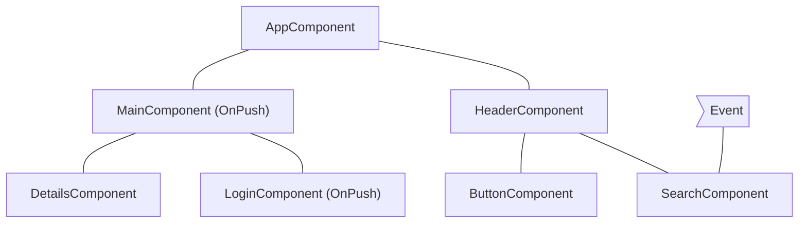
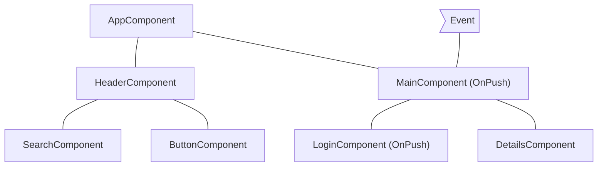
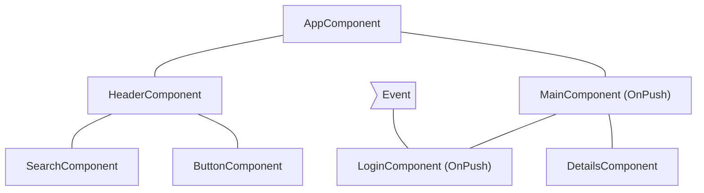
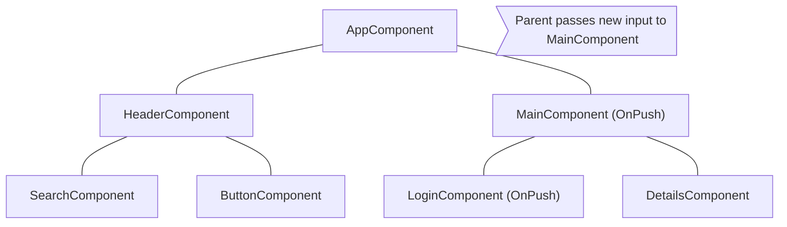

<!-- ia-translate: true -->
# Pulando subárvores de components

JavaScript, por padrão, usa estruturas de dados mutáveis que você pode referenciar de múltiplos components diferentes. O Angular executa change detection em toda a sua árvore de components para garantir que o estado mais atualizado das suas estruturas de dados seja refletido no DOM.

A change detection é suficientemente rápida para a maioria das aplicações. No entanto, quando uma aplicação tem uma árvore de components especialmente grande, executar change detection em toda a aplicação pode causar problemas de performance. Você pode resolver isso configurando a change detection para executar apenas em um subconjunto da árvore de components.

Se você tem certeza de que uma parte da aplicação não é afetada por uma mudança de estado, você pode usar [OnPush](/api/core/ChangeDetectionStrategy) para pular a change detection em uma subárvore inteira de components.

## Usando `OnPush`

A change detection OnPush instrui o Angular a executar change detection para uma subárvore de components **apenas** quando:

- O component raiz da subárvore recebe novos inputs como resultado de um template binding. O Angular compara o valor atual e passado do input com `==`.
- O Angular trata um evento _(por exemplo, usando event binding, output binding ou `@HostListener`)_ no component raiz da subárvore ou em qualquer um de seus filhos, independentemente de estarem usando change detection OnPush ou não.

Você pode definir a estratégia de change detection de um component para `OnPush` no decorator `@Component`:

```ts
import { ChangeDetectionStrategy, Component } from '@angular/core';
@Component({
  changeDetection: ChangeDetectionStrategy.OnPush,
})
export class MyComponent {}
```

## Cenários comuns de change detection

Esta seção examina vários cenários comuns de change detection para ilustrar o comportamento do Angular.

### Um evento é tratado por um component com change detection padrão

Se o Angular tratar um evento dentro de um component sem a estratégia `OnPush`, o framework executa change detection em toda a árvore de components. O Angular pulará subárvores de components descendentes com raízes usando `OnPush`, que não receberam novos inputs.

Como exemplo, se definirmos a estratégia de change detection do `MainComponent` para `OnPush` e o usuário interagir com um component fora da subárvore com raiz `MainComponent`, o Angular verificará todos os components rosa do diagrama abaixo (`AppComponent`, `HeaderComponent`, `SearchComponent`, `ButtonComponent`), a menos que `MainComponent` receba novos inputs:



## Um evento é tratado por um component com OnPush

Se o Angular tratar um evento dentro de um component com estratégia OnPush, o framework executará change detection dentro de toda a árvore de components. O Angular ignorará subárvores de components com raízes usando OnPush, que não receberam novos inputs e estão fora do component que tratou o evento.

Como exemplo, se o Angular tratar um evento dentro de `MainComponent`, o framework executará change detection em toda a árvore de components. O Angular ignorará a subárvore com raiz `LoginComponent` porque ela tem `OnPush` e o evento aconteceu fora do seu escopo.



## Um evento é tratado por um descendente de um component com OnPush

Se o Angular tratar um evento em um component com OnPush, o framework executará change detection em toda a árvore de components, incluindo os ancestrais do component.

Como exemplo, no diagrama abaixo, o Angular trata um evento no `LoginComponent` que usa OnPush. O Angular invocará change detection em toda a subárvore de components, incluindo `MainComponent` (pai de `LoginComponent`), mesmo que `MainComponent` também tenha `OnPush`. O Angular verifica `MainComponent` também porque `LoginComponent` faz parte de sua view.



## Novos inputs para component com OnPush

O Angular executará change detection dentro de um component filho com `OnPush` ao definir uma propriedade de input como resultado de um template binding.

Por exemplo, no diagrama abaixo, `AppComponent` passa um novo input para `MainComponent`, que tem `OnPush`. O Angular executará change detection em `MainComponent`, mas não executará change detection em `LoginComponent`, que também tem `OnPush`, a menos que ele também receba novos inputs.



## Casos extremos

- **Modificando propriedades de input em código TypeScript**. Quando você usa uma API como `@ViewChild` ou `@ContentChild` para obter uma referência a um component em TypeScript e modificar manualmente uma propriedade `@Input`, o Angular não executará automaticamente change detection para components OnPush. Se você precisar que o Angular execute change detection, você pode injetar `ChangeDetectorRef` no seu component e chamar `changeDetectorRef.markForCheck()` para dizer ao Angular para agendar uma change detection.
- **Modificando referências de objetos**. Caso um input receba um objeto mutável como valor e você modifique o objeto mas preserve a referência, o Angular não invocará change detection. Esse é o comportamento esperado porque o valor anterior e o valor atual do input apontam para a mesma referência.
