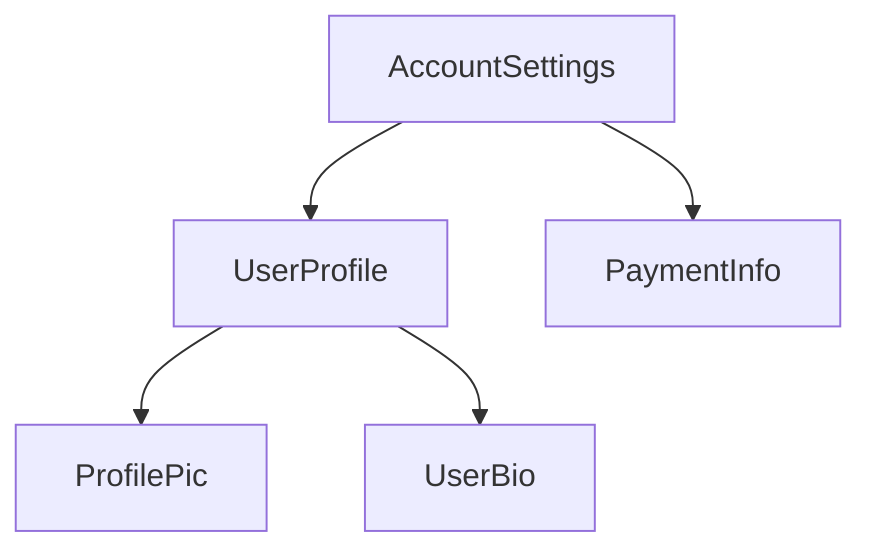

<!-- ia-translate: true -->
<docs-decorative-header title="Anatomia de um component" imgSrc="adev/src/assets/images/components.svg"> <!-- markdownlint-disable-line -->
</docs-decorative-header>

TIP: Este guia pressupõe que você já leu o [Guia de Fundamentos](essentials). Leia-o primeiro se você é novo no Angular.

Todo component deve ter:

- Uma classe TypeScript com _comportamentos_ como manipulação de entrada do usuário e busca de dados de um servidor
- Um template HTML que controla o que é renderizado no DOM
- Um [seletor CSS](https://developer.mozilla.org/docs/Learn/CSS/Building_blocks/Selectors) que define como o component é usado no HTML

Você fornece informações específicas do Angular para um component adicionando um [decorator](https://www.typescriptlang.org/docs/handbook/decorators.html) `@Component` no topo da classe TypeScript:

<docs-code language="angular-ts" highlight="[1, 2, 3, 4]">
@Component({
  selector: 'profile-photo',
  template: ``,
})
export class ProfilePhoto { }
</docs-code>

Para detalhes completos sobre como escrever templates Angular, incluindo data binding, manipulação de eventos e controle de fluxo, consulte o [guia de Templates](guide/templates).

O objeto passado para o decorator `@Component` é chamado de **metadata** do component. Isso inclui o `selector`, `template` e outras propriedades descritas ao longo deste guia.

Components podem opcionalmente incluir uma lista de estilos CSS que se aplicam ao DOM daquele component:

<docs-code language="angular-ts" highlight="[4]">
@Component({
  selector: 'profile-photo',
  template: ``,
  styles: `img { border-radius: 50%; }`,
})
export class ProfilePhoto { }
</docs-code>

Por padrão, os estilos de um component afetam apenas os elementos definidos no template daquele component. Consulte [Estilizando Components](guide/components/styling) para detalhes sobre a abordagem do Angular para estilização.

Você pode alternativamente optar por escrever seu template e estilos em arquivos separados:

<docs-code language="angular-ts" highlight="[3, 4]">
@Component({
  selector: 'profile-photo',
  templateUrl: 'profile-photo.html',
  styleUrl: 'profile-photo.css',
})
export class ProfilePhoto { }
</docs-code>

Isso pode ajudar a separar as preocupações de _apresentação_ de _comportamento_ em seu projeto. Você pode escolher uma abordagem para todo o seu projeto, ou decidir qual usar para cada component.

Tanto `templateUrl` quanto `styleUrl` são relativos ao diretório no qual o component reside.

## Usando components

### Imports no decorator `@Component`

Para usar um component, [directive](guide/directives) ou [pipe](guide/templates/pipes), você deve adicioná-lo ao array `imports` no decorator `@Component`:

```ts
import {ProfilePhoto} from './profile-photo';

@Component({
  // Import the `ProfilePhoto` component in
  // order to use it in this component's template.
  imports: [ProfilePhoto],
  /* ... */
})
export class UserProfile { }
```

Por padrão, components Angular são _standalone_, o que significa que você pode adicioná-los diretamente ao array `imports` de outros components. Components criados com uma versão anterior do Angular podem, em vez disso, especificar `standalone: false` em seu decorator `@Component`. Para esses components, você deve importar o `NgModule` no qual o component está definido. Consulte o [guia completo do `NgModule`](guide/ngmodules) para detalhes.

Important: Nas versões do Angular anteriores à 19.0.0, a opção `standalone` tem como padrão `false`.

### Mostrando components em um template

Todo component define um [seletor CSS](https://developer.mozilla.org/docs/Learn/CSS/Building_blocks/Selectors):

<docs-code language="angular-ts" highlight="[2]">
@Component({
  selector: 'profile-photo',
  ...
})
export class ProfilePhoto { }
</docs-code>

Consulte [Seletores de Components](guide/components/selectors) para detalhes sobre quais tipos de seletores o Angular suporta e orientações sobre como escolher um seletor.

Você mostra um component criando um elemento HTML correspondente no template de _outros_ components:

<docs-code language="angular-ts" highlight="[8]">
@Component({
  selector: 'profile-photo',
})
export class ProfilePhoto { }

@Component({
imports: [ProfilePhoto],
template: `<profile-photo />`
})
export class UserProfile { }
</docs-code>

O Angular cria uma instância do component para cada elemento HTML correspondente que encontra. O elemento DOM que corresponde ao seletor de um component é referido como o **elemento host** daquele component. O conteúdo do template de um component é renderizado dentro de seu elemento host.

O DOM renderizado por um component, correspondente ao template daquele component, é chamado de **view** daquele component.

Ao compor components dessa maneira, **você pode pensar em sua aplicação Angular como uma árvore de components**.



Essa estrutura de árvore é importante para entender vários outros conceitos do Angular, incluindo [injeção de dependência](guide/di) e [consultas filhas](guide/components/queries).
