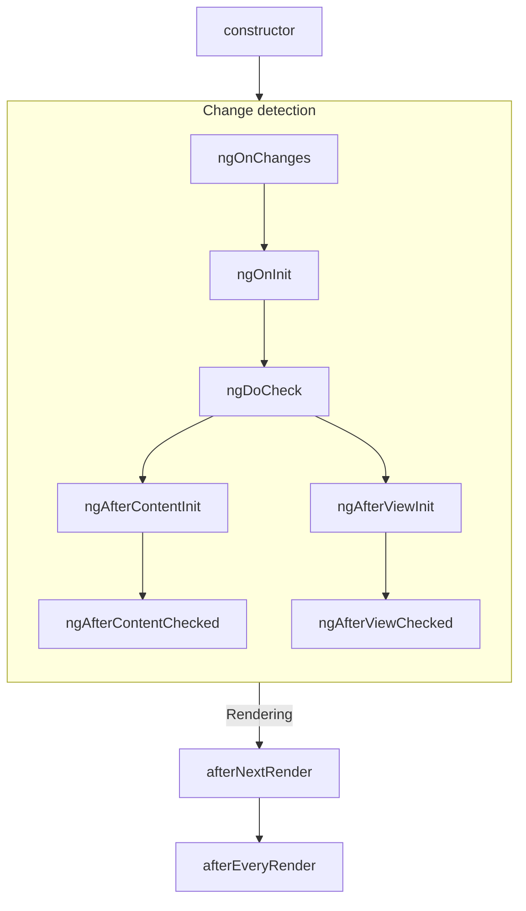
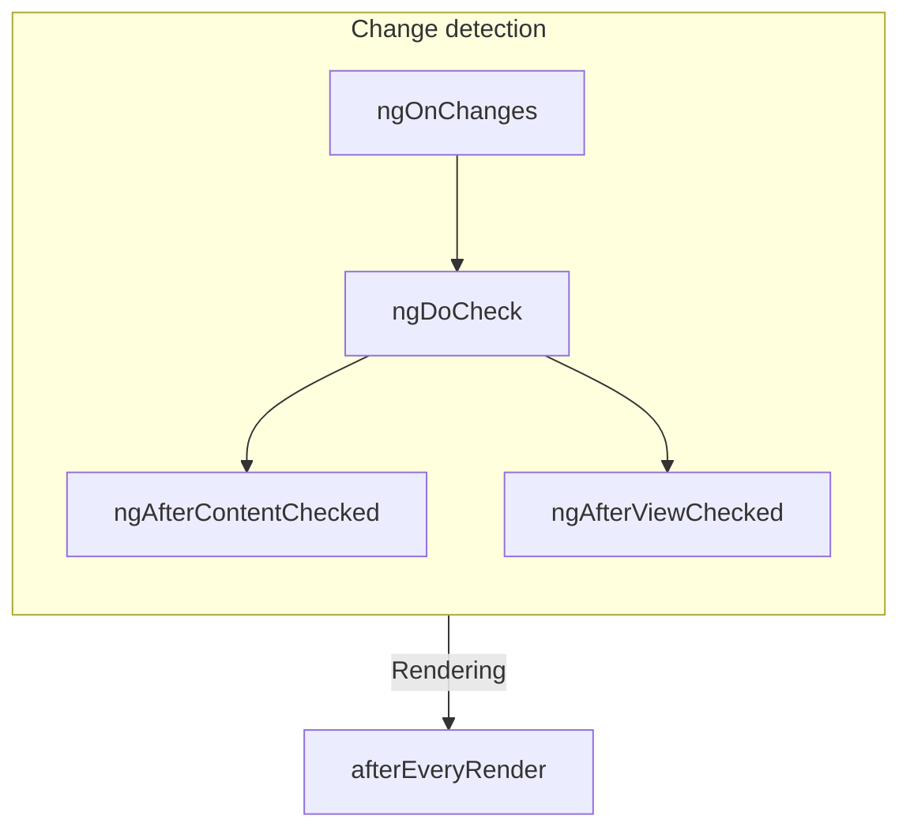

<!-- ia-translate: true -->
# Ciclo de Vida de Component

TIP: Este guia pressupõe que você já leu o [Guia de Fundamentos](essentials). Leia-o primeiro se você é novo no Angular.

O **ciclo de vida** de um component é a sequência de etapas que acontecem entre a criação do component e sua destruição. Cada etapa representa uma parte diferente do processo do Angular para renderizar components e verificá-los quanto a atualizações ao longo do tempo.

Em seus components, você pode implementar **hooks de ciclo de vida** para executar código durante essas etapas. Hooks de ciclo de vida que se relacionam a uma instância específica de component são implementados como métodos na sua classe de component. Hooks de ciclo de vida que se relacionam à aplicação Angular como um todo são implementados como funções que aceitam um callback.

O ciclo de vida de um component está intimamente conectado a como o Angular verifica seus components quanto a mudanças ao longo do tempo. Para fins de entendimento deste ciclo de vida, você só precisa saber que o Angular percorre a árvore da sua aplicação de cima para baixo, verificando bindings de template quanto a mudanças. Os hooks de ciclo de vida descritos abaixo são executados enquanto o Angular está fazendo esta travessia. Esta travessia visita cada component exatamente uma vez, então você deve sempre evitar fazer outras mudanças de estado no meio do processo.

## Resumo

<div class="docs-table docs-scroll-track-transparent">
  <table>
    <tr>
      <td><strong>Fase</strong></td>
      <td><strong>Método</strong></td>
      <td><strong>Resumo</strong></td>
    </tr>
    <tr>
      <td>Criação</td>
      <td><code>constructor</code></td>
      <td>
        <a href="https://developer.mozilla.org/docs/Web/JavaScript/Reference/Classes/constructor" target="_blank">
          Constructor de classe JavaScript padrão
        </a>. Executa quando o Angular instancia o component.
      </td>
    </tr>
    <tr>
      <td rowspan="7">Detecção<p>de Mudanças</td>
      <td><code>ngOnInit</code>
      </td>
      <td>Executa uma vez após o Angular ter inicializado todos os inputs do component.</td>
    </tr>
    <tr>
      <td><code>ngOnChanges</code></td>
      <td>Executa toda vez que os inputs do component mudarem.</td>
    </tr>
    <tr>
      <td><code>ngDoCheck</code></td>
      <td>Executa toda vez que este component é verificado quanto a mudanças.</td>
    </tr>
    <tr>
      <td><code>ngAfterContentInit</code></td>
      <td>Executa uma vez após o <em>conteúdo</em> do component ter sido inicializado.</td>
    </tr>
    <tr>
      <td><code>ngAfterContentChecked</code></td>
      <td>Executa toda vez que o conteúdo deste component foi verificado quanto a mudanças.</td>
    </tr>
    <tr>
      <td><code>ngAfterViewInit</code></td>
      <td>Executa uma vez após a <em>view</em> do component ter sido inicializada.</td>
    </tr>
    <tr>
      <td><code>ngAfterViewChecked</code></td>
      <td>Executa toda vez que a view do component foi verificada quanto a mudanças.</td>
    </tr>
    <tr>
      <td rowspan="2">Renderização</td>
      <td><code>afterNextRender</code></td>
      <td>Executa uma vez na próxima vez que <strong>todos</strong> os components forem renderizados no DOM.</td>
    </tr>
    <tr>
      <td><code>afterEveryRender</code></td>
      <td>Executa toda vez que <strong>todos</strong> os components forem renderizados no DOM.</td>
    </tr>
    <tr>
      <td>Destruição</td>
      <td><code>ngOnDestroy</code></td>
      <td>Executa uma vez antes do component ser destruído.</td>
    </tr>
  </table>
</div>

### ngOnInit

O método `ngOnInit` executa após o Angular ter inicializado todos os inputs do component com seus valores iniciais. O `ngOnInit` de um component executa exatamente uma vez.

Esta etapa acontece _antes_ do próprio template do component ser inicializado. Isso significa que você pode atualizar o estado do component com base em seus valores iniciais de input.

### ngOnChanges

O método `ngOnChanges` executa após qualquer input de component ter mudado.

Esta etapa acontece _antes_ do próprio template do component ser verificado. Isso significa que você pode atualizar o estado do component com base em seus valores iniciais de input.

Durante a inicialização, o primeiro `ngOnChanges` executa antes do `ngOnInit`.

#### Inspecionando mudanças

O método `ngOnChanges` aceita um argumento `SimpleChanges`. Este objeto é um [`Record`](https://www.typescriptlang.org/docs/handbook/utility-types.html#recordkeys-type) mapeando cada nome de input do component para um objeto `SimpleChange`. Cada `SimpleChange` contém o valor anterior do input, seu valor atual e uma flag para se esta é a primeira vez que o input mudou.

```ts
@Component({
  /* ... */
})
export class UserProfile {
  name = input('');

  ngOnChanges(changes: SimpleChanges) {
    for (const inputName in changes) {
      const inputValues = changes[inputName];
      console.log(`Previous ${inputName} == ${inputValues.previousValue}`);
      console.log(`Current ${inputName} == ${inputValues.currentValue}`);
      console.log(`Is first ${inputName} change == ${inputValues.firstChange}`);
    }
  }
}
```

Se você fornecer um `alias` para quaisquer propriedades de input, o Record `SimpleChanges` ainda usa o nome da propriedade TypeScript como chave, em vez do alias.

### ngOnDestroy

O método `ngOnDestroy` executa uma vez pouco antes de um component ser destruído. O Angular destrói um component quando ele não é mais mostrado na página, como sendo ocultado por `@if` ou ao navegar para outra página.

#### DestroyRef

Como uma alternativa ao método `ngOnDestroy`, você pode injetar uma instância de `DestroyRef`. Você pode registrar um callback para ser invocado na destruição do component chamando o método `onDestroy` de `DestroyRef`.

```ts
@Component({
  /* ... */
})
export class UserProfile {
  constructor() {
    inject(DestroyRef).onDestroy(() => {
      console.log('UserProfile destruction');
    });
  }
}
```

Você pode passar a instância de `DestroyRef` para funções ou classes fora do seu component. Use este padrão se você tiver outro código que deve executar algum comportamento de limpeza quando o component for destruído.

Você também pode usar `DestroyRef` para manter o código de configuração próximo ao código de limpeza, em vez de colocar todo o código de limpeza no método `ngOnDestroy`.

##### Detectando destruição de instância

`DestroyRef` fornece uma propriedade `destroyed` que permite verificar se uma determinada instância já foi destruída. Isso é útil para evitar operações em components destruídos, especialmente ao lidar com lógica atrasada ou assíncrona.

Ao verificar `destroyRef.destroyed`, você pode prevenir a execução de código após a instância ter sido limpa, evitando erros potenciais como `NG0911: View has already been destroyed.`.

### ngDoCheck

O método `ngDoCheck` executa antes de toda vez que o Angular verifica o template de um component quanto a mudanças.

Você pode usar este hook de ciclo de vida para verificar manualmente mudanças de estado fora da detecção normal de mudanças do Angular, atualizando manualmente o estado do component.

Este método executa muito frequentemente e pode impactar significativamente o desempenho da sua página. Evite definir este hook sempre que possível, usando-o apenas quando você não tiver alternativa.

Durante a inicialização, o primeiro `ngDoCheck` executa após `ngOnInit`.

### ngAfterContentInit

O método `ngAfterContentInit` executa uma vez após todos os filhos aninhados dentro do component (seu _conteúdo_) terem sido inicializados.

Você pode usar este hook de ciclo de vida para ler os resultados de [consultas de conteúdo](guide/components/queries#content-queries). Embora você possa acessar o estado inicializado dessas consultas, tentar alterar qualquer estado neste método resulta em um [ExpressionChangedAfterItHasBeenCheckedError](errors/NG0100).

### ngAfterContentChecked

O método `ngAfterContentChecked` executa toda vez que os filhos aninhados dentro do component (seu _conteúdo_) foram verificados quanto a mudanças.

Este método executa muito frequentemente e pode impactar significativamente o desempenho da sua página. Evite definir este hook sempre que possível, usando-o apenas quando você não tiver alternativa.

Embora você possa acessar o estado atualizado de [consultas de conteúdo](guide/components/queries#content-queries) aqui, tentar alterar qualquer estado neste método resulta em um [ExpressionChangedAfterItHasBeenCheckedError](errors/NG0100).

### ngAfterViewInit

O método `ngAfterViewInit` executa uma vez após todos os filhos no template do component (sua _view_) terem sido inicializados.

Você pode usar este hook de ciclo de vida para ler os resultados de [consultas de view](guide/components/queries#view-queries). Embora você possa acessar o estado inicializado dessas consultas, tentar alterar qualquer estado neste método resulta em um [ExpressionChangedAfterItHasBeenCheckedError](errors/NG0100).

### ngAfterViewChecked

O método `ngAfterViewChecked` executa toda vez que os filhos no template do component (sua _view_) foram verificados quanto a mudanças.

Este método executa muito frequentemente e pode impactar significativamente o desempenho da sua página. Evite definir este hook sempre que possível, usando-o apenas quando você não tiver alternativa.

Embora você possa acessar o estado atualizado de [consultas de view](guide/components/queries#view-queries) aqui, tentar alterar qualquer estado neste método resulta em um [ExpressionChangedAfterItHasBeenCheckedError](errors/NG0100).

### afterEveryRender e afterNextRender

As funções `afterEveryRender` e `afterNextRender` permitem que você registre um **callback de renderização** para ser invocado após o Angular ter terminado de renderizar _todos os components_ na página no DOM.

Essas funções são diferentes dos outros hooks de ciclo de vida descritos neste guia. Em vez de um método de classe, são funções autônomas que aceitam um callback. A execução de callbacks de renderização não está vinculada a nenhuma instância de component específica, mas sim a um hook em toda a aplicação.

`afterEveryRender` e `afterNextRender` devem ser chamados em um [contexto de injeção](guide/di/dependency-injection-context), tipicamente no constructor de um component.

Você pode usar callbacks de renderização para realizar operações manuais do DOM. Consulte [Usando APIs DOM](guide/components/dom-apis) para orientação sobre trabalhar com o DOM no Angular.

Callbacks de renderização não são executados durante renderização no servidor ou durante pré-renderização em tempo de build.

#### Fases after\*Render

Ao usar `afterEveryRender` ou `afterNextRender`, você pode opcionalmente dividir o trabalho em fases. A fase dá a você controle sobre o sequenciamento de operações DOM, permitindo sequenciar operações de _escrita_ antes de operações de _leitura_ para minimizar [layout thrashing](https://web.dev/avoid-large-complex-layouts-and-layout-thrashing). Para se comunicar entre fases, uma função de fase pode retornar um valor de resultado que pode ser acessado na próxima fase.

```ts
import {Component, ElementRef, afterNextRender} from '@angular/core';

@Component({...})
export class UserProfile {
  private prevPadding = 0;
  private elementHeight = 0;

  constructor() {
    private elementRef = inject(ElementRef);
    const nativeElement = elementRef.nativeElement;

    afterNextRender({
      // Use the `Write` phase to write to a geometric property.
      write: () => {
        const padding = computePadding();
        const changed = padding !== this.prevPadding;
        if (changed) {
          nativeElement.style.padding = padding;
        }
        return changed; // Communicate whether anything changed to the read phase.
      },

      // Use the `Read` phase to read geometric properties after all writes have occurred.
      read: (didWrite) => {
        if (didWrite) {
          this.elementHeight = nativeElement.getBoundingClientRect().height;
        }
      }
    });
  }
}
```

Existem quatro fases, executadas na seguinte ordem:

| Fase             | Descrição                                                                                                                                                                                                                  |
| ---------------- | -------------------------------------------------------------------------------------------------------------------------------------------------------------------------------------------------------------------------- |
| `earlyRead`      | Use esta fase para ler quaisquer propriedades e estilos DOM que afetam o layout e que são estritamente necessários para cálculos subsequentes. Evite esta fase se possível, preferindo as fases `write` e `read`.         |
| `mixedReadWrite` | Fase padrão. Use para quaisquer operações que precisam ler e escrever propriedades e estilos que afetam o layout. Evite esta fase se possível, preferindo as fases explícitas `write` e `read`.                           |
| `write`          | Use esta fase para escrever propriedades e estilos DOM que afetam o layout.                                                                                                                                               |
| `read`           | Use esta fase para ler quaisquer propriedades DOM que afetam o layout.                                                                                                                                                    |

## Interfaces de ciclo de vida

O Angular fornece uma interface TypeScript para cada método de ciclo de vida. Você pode opcionalmente importar e `implementar` essas interfaces para garantir que sua implementação não tenha erros de digitação.

Cada interface tem o mesmo nome que o método correspondente sem o prefixo `ng`. Por exemplo, a interface para `ngOnInit` é `OnInit`.

```ts
@Component({
  /* ... */
})
export class UserProfile implements OnInit {
  ngOnInit() {
    /* ... */
  }
}
```

## Ordem de execução

Os diagramas a seguir mostram a ordem de execução dos hooks de ciclo de vida do Angular.

### Durante a inicialização



### Atualizações subsequentes



### Ordenação com directives

Quando você coloca uma ou mais directives no mesmo elemento que um component, seja em um template ou com a propriedade `hostDirectives`, o framework não garante qualquer ordenação de um determinado hook de ciclo de vida entre o component e as directives em um único elemento. Nunca dependa de uma ordenação observada, pois isso pode mudar em versões posteriores do Angular.
