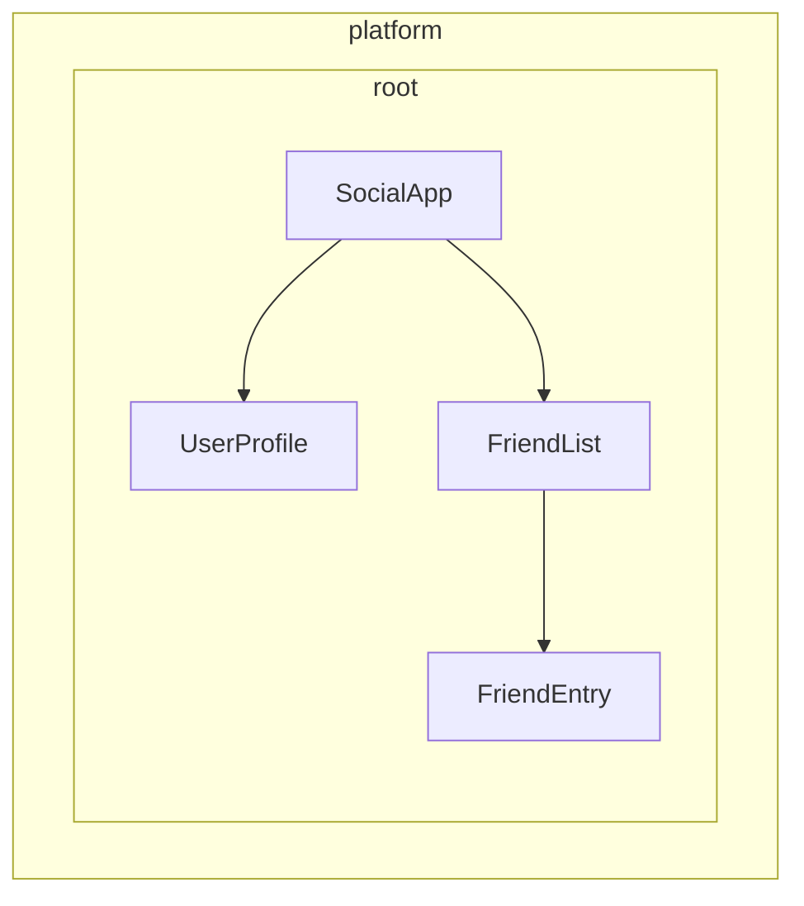

<!-- ia-translate: true -->
# Definindo providers de dependência

O Angular oferece duas maneiras de tornar services disponíveis para injeção:

1. **Provisão automática** - Usando `providedIn` no decorator `@Injectable` ou fornecendo uma factory na configuração do `InjectionToken`
2. **Provisão manual** - Usando o array `providers` em components, directives, routes ou configuração da aplicação

No [guia anterior](/guide/di/creating-and-using-services), você aprendeu como criar services usando `providedIn: 'root'`, que lida com os casos de uso mais comuns. Este guia explora padrões adicionais para configuração de provider tanto automática quanto manual.

## Provisão automática para dependências não-classe

Enquanto o decorator `@Injectable` com `providedIn: 'root'` funciona muito bem para services (classes), você pode precisar fornecer outros tipos de valores globalmente - como objetos de configuração, funções ou valores primitivos. O Angular fornece `InjectionToken` para esse propósito.

### O que é um InjectionToken?

Um `InjectionToken` é um objeto que o sistema de dependency injection do Angular usa para identificar exclusivamente valores para injeção. Pense nele como uma chave especial que permite armazenar e recuperar qualquer tipo de valor no sistema DI do Angular:

```ts
import { InjectionToken } from '@angular/core';

// Create a token for a string value
export const API_URL = new InjectionToken<string>('api.url');

// Create a token for a function
export const LOGGER = new InjectionToken<(msg: string) => void>('logger.function');

// Create a token for a complex type
export interface Config {
  apiUrl: string;
  timeout: number;
}
export const CONFIG_TOKEN = new InjectionToken<Config>('app.config');
```

NOTA: O parâmetro string (por exemplo, `'api.url'`) é uma descrição puramente para debug — o Angular identifica tokens por sua referência de objeto, não por essa string.

### InjectionToken com `providedIn: 'root'`

Um `InjectionToken` que tem uma `factory` resulta em `providedIn: 'root'` por padrão (mas pode ser sobrescrito via a propriedade `providedIn`).

```ts
// 📁 /app/config.token.ts
import { InjectionToken } from '@angular/core';

export interface AppConfig {
  apiUrl: string;
  version: string;
  features: Record<string, boolean>;
}

// Globally available configuration using providedIn
export const APP_CONFIG = new InjectionToken<AppConfig>('app.config', {
  providedIn: 'root',
  factory: () => ({
    apiUrl: 'https://api.example.com',
    version: '1.0.0',
    features: {
      darkMode: true,
      analytics: false
    }
  })
});

// No need to add to providers array - available everywhere!
@Component({
  selector: 'app-header',
  template: `<h1>Version: {{ config.version }}</h1>`
})
export class HeaderComponent {
  config = inject(APP_CONFIG); // Automatically available
}
```

### Quando usar InjectionToken com funções factory

InjectionToken com funções factory é ideal quando você não pode usar uma classe mas precisa fornecer dependências globalmente:

```ts
// 📁 /app/logger.token.ts
import { InjectionToken, inject } from '@angular/core';
import { APP_CONFIG } from './config.token';

// Logger function type
export type LoggerFn = (level: string, message: string) => void;

// Global logger function with dependencies
export const LOGGER_FN = new InjectionToken<LoggerFn>('logger.function', {
  providedIn: 'root',
  factory: () => {
    const config = inject(APP_CONFIG);

    return (level: string, message: string) => {
      if (config.features.logging !== false) {
        console[level](`[${new Date().toISOString()}] ${message}`);
      }
    };
  }
});

// 📁 /app/storage.token.ts
// Providing browser APIs as tokens
export const LOCAL_STORAGE = new InjectionToken<Storage>('localStorage', {
  // providedIn: 'root' is configured as the default
  factory: () => window.localStorage
});

export const SESSION_STORAGE = new InjectionToken<Storage>('sessionStorage', {
  providedIn: 'root',
  factory: () => window.sessionStorage
});

// 📁 /app/feature-flags.token.ts
// Complex configuration with runtime logic
export const FEATURE_FLAGS = new InjectionToken<Map<string, boolean>>('feature.flags', {
  providedIn: 'root',
  factory: () => {
    const flags = new Map<string, boolean>();

    // Parse from environment or URL params
    const urlParams = new URLSearchParams(window.location.search);
    const enableBeta = urlParams.get('beta') === 'true';

    flags.set('betaFeatures', enableBeta);
    flags.set('darkMode', true);
    flags.set('newDashboard', false);

    return flags;
  }
});
```

Esta abordagem oferece várias vantagens:

- **Nenhuma configuração manual de provider necessária** - Funciona como `providedIn: 'root'` para services
- **Tree-shakeable** - Apenas incluído se realmente usado
- **Type-safe** - Suporte completo ao TypeScript para valores não-classe
- **Pode injetar outras dependências** - Funções factory podem usar `inject()` para acessar outros services

## Entendendo a configuração manual de provider

Quando você precisa de mais controle do que `providedIn: 'root'` oferece, você pode configurar providers manualmente. A configuração manual através do array `providers` é útil quando:

1. **O service não tem `providedIn`** - Services sem provisão automática devem ser fornecidos manualmente
2. **Você quer uma nova instância** - Para criar uma instância separada no nível component/directive ao invés de usar a compartilhada
3. **Você precisa de configuração em tempo de execução** - Quando o comportamento do service depende de valores em runtime
4. **Você está fornecendo valores não-classe** - Objetos de configuração, funções ou valores primitivos

### Exemplo: Service sem `providedIn`

```ts
import { Injectable, Component, inject } from '@angular/core';

// Service without providedIn
@Injectable()
export class LocalDataStore {
  private data: string[] = [];

  addData(item: string) {
    this.data.push(item);
  }
}

// Component must provide it
@Component({
  selector: 'app-example',
  // A provider is required here because the `LocalDataStore` service has no providedIn.
  providers: [LocalDataStore],
  template: `...`
})
export class ExampleComponent {
  dataStore = inject(LocalDataStore);
}
```

### Exemplo: Criando instâncias específicas de component

Services com `providedIn: 'root'` podem ser sobrescritos no nível do component. Isso vincula a instância do service ao ciclo de vida de um component. Como resultado, quando o component é destruído, o service fornecido também é destruído.

```ts
import { Injectable, Component, inject } from '@angular/core';

@Injectable({ providedIn: 'root' })
export class DataStore {
  private data: ListItem[] = [];
}

// This component gets its own instance
@Component({
  selector: 'app-isolated',
  // Creates new instance of `DataStore` rather than using the root-provided instance.
  providers: [DataStore],
  template: `...`
})
export class IsolatedComponent {
  dataStore = inject(DataStore); // Component-specific instance
}
```

## Hierarquia de injector no Angular

O sistema de dependency injection do Angular é hierárquico. Quando um component solicita uma dependência, o Angular começa com o injector daquele component e sobe na árvore até encontrar um provider para aquela dependência. Cada component na sua árvore de aplicação pode ter seu próprio injector, e esses injectors formam uma hierarquia que espelha sua árvore de components.

Esta hierarquia habilita:

- **Instâncias com escopo**: Diferentes partes da sua aplicação podem ter diferentes instâncias do mesmo service
- **Sobrescrever comportamento**: Components filhos podem sobrescrever providers de components pais
- **Eficiência de memória**: Services são instanciados apenas onde necessário

No Angular, qualquer elemento com um component ou directive pode fornecer valores para todos os seus descendentes.



No exemplo acima:

1. `SocialApp` pode fornecer valores para `UserProfile` e `FriendList`
2. `FriendList` pode fornecer valores para injeção em `FriendEntry`, mas não pode fornecer valores para injeção em `UserProfile` porque não faz parte da árvore

## Declarando um provider

Pense no sistema de dependency injection do Angular como um hash map ou dicionário. Cada objeto de configuração de provider define um par chave-valor:

- **Chave (Identificador do provider)**: O identificador único que você usa para solicitar uma dependência
- **Valor**: O que o Angular deve retornar quando aquele token for solicitado

Ao fornecer dependências manualmente, você tipicamente vê esta sintaxe abreviada:

```angular-ts
import { Component } from '@angular/core';
import { LocalService } from './local-service';

@Component({
  selector: 'app-example',
  providers: [LocalService]  // Service without providedIn
})
export class ExampleComponent { }
```

Isso é na verdade uma forma abreviada para uma configuração de provider mais detalhada:

```ts
{
  // This is the shorthand version
  providers: [LocalService],

  // This is the full version
  providers: [
    { provide: LocalService, useClass: LocalService }
  ]
}
```

### Objeto de configuração do provider

Todo objeto de configuração de provider tem duas partes principais:

1. **Identificador do provider**: A chave única que o Angular usa para obter a dependência (definida via a propriedade `provide`)
2. **Valor**: A dependência real que você quer que o Angular busque, configurada com diferentes chaves baseadas no tipo desejado:
   - `useClass` - Fornece uma classe JavaScript
   - `useValue` - Fornece um valor estático
   - `useFactory` - Fornece uma função factory que retorna o valor
   - `useExisting` - Fornece um alias para um provider existente

### Identificadores de provider

Identificadores de provider permitem ao sistema de dependency injection (DI) do Angular recuperar uma dependência através de um ID único. Você pode gerar identificadores de provider de duas maneiras:

1. [Nomes de classe](#class-names)
2. [Injection tokens](#injection-tokens)

#### Nomes de classe

Nomes de classe usam a classe importada diretamente como o identificador:

```angular-ts
import { Component } from '@angular/core';
import { LocalService } from './local-service';

@Component({
  selector: 'app-example',
  providers: [
    { provide: LocalService, useClass: LocalService }
  ]
})
export class ExampleComponent { /* ... */ }
```

A classe serve tanto como identificador quanto como implementação, que é por isso que o Angular fornece a forma abreviada `providers: [LocalService]`.

#### Injection tokens

O Angular fornece uma classe [`InjectionToken`](api/core/InjectionToken) integrada que cria uma referência de objeto única para valores injetáveis ou quando você quer fornecer múltiplas implementações da mesma interface.

```ts
// 📁 /app/tokens.ts
import { InjectionToken } from '@angular/core';
import { DataService } from './data-service.interface';

export const DATA_SERVICE_TOKEN = new InjectionToken<DataService>('DataService');
```

NOTA: A string `'DataService'` é uma descrição usada puramente para propósitos de debug. O Angular identifica o token por sua referência de objeto, não por essa string.

Use o token na sua configuração de provider:

```angular-ts
import { Component, inject } from '@angular/core';
import { LocalDataService } from './local-data-service';
import { DATA_SERVICE_TOKEN } from './tokens';

@Component({
  selector: 'app-example',
  providers: [
    { provide: DATA_SERVICE_TOKEN, useClass: LocalDataService }
  ]
})
export class ExampleComponent {
  private dataService = inject(DATA_SERVICE_TOKEN);
}
```

#### Interfaces TypeScript podem ser identificadores para injeção?

Interfaces TypeScript não podem ser usadas para injeção porque elas não existem em tempo de execução:

```ts
// ❌ This won't work!
interface DataService {
  getData(): string[];
}

// Interfaces disappear after TypeScript compilation
@Component({
  providers: [
    { provide: DataService, useClass: LocalDataService } // Error!
  ]
})
export class ExampleComponent {
  private dataService = inject(DataService); // Error!
}

// ✅ Use InjectionToken instead
export const DATA_SERVICE_TOKEN = new InjectionToken<DataService>('DataService');

@Component({
  providers: [
    { provide: DATA_SERVICE_TOKEN, useClass: LocalDataService }
  ]
})
export class ExampleComponent {
  private dataService = inject(DATA_SERVICE_TOKEN); // Works!
}
```

O InjectionToken fornece um valor em tempo de execução que o sistema DI do Angular pode usar, enquanto ainda mantém type safety através do parâmetro de tipo genérico do TypeScript.

### Tipos de valor de provider

#### useClass

`useClass` fornece uma classe JavaScript como dependência. Este é o padrão ao usar a sintaxe abreviada:

```ts
// Shorthand
providers: [DataService]

// Full syntax
providers: [
  { provide: DataService, useClass: DataService }
]

// Different implementation
providers: [
  { provide: DataService, useClass: MockDataService }
]

// Conditional implementation
providers: [
  {
    provide: StorageService,
    useClass: environment.production ? CloudStorageService : LocalStorageService
  }
]
```

#### Exemplo prático: Substituição de Logger

Você pode substituir implementações para estender funcionalidade:

```ts
import { Injectable, Component, inject } from '@angular/core';

// Base logger
@Injectable()
export class Logger {
  log(message: string) {
    console.log(message);
  }
}

// Enhanced logger with timestamp
@Injectable()
export class BetterLogger extends Logger {
  override log(message: string) {
    super.log(`[${new Date().toISOString()}] ${message}`);
  }
}

// Logger that includes user context
@Injectable()
export class EvenBetterLogger extends Logger {
  private userService = inject(UserService);

  override log(message: string) {
    const name = this.userService.user.name;
    super.log(`Message to ${name}: ${message}`);
  }
}

// In your component
@Component({
  selector: 'app-example',
  providers: [
    UserService, // EvenBetterLogger needs this
    { provide: Logger, useClass: EvenBetterLogger }
  ]
})
export class ExampleComponent {
  private logger = inject(Logger); // Gets EvenBetterLogger instance
}
```

#### useValue

`useValue` fornece qualquer tipo de dado JavaScript como um valor estático:

```ts
providers: [
  { provide: API_URL_TOKEN, useValue: 'https://api.example.com' },
  { provide: MAX_RETRIES_TOKEN, useValue: 3 },
  { provide: FEATURE_FLAGS_TOKEN, useValue: { darkMode: true, beta: false } }
]
```

IMPORTANTE: Tipos e interfaces TypeScript não podem servir como valores de dependência. Eles existem apenas em tempo de compilação.

#### Exemplo prático: Configuração da aplicação

Um caso de uso comum para `useValue` é fornecer configuração da aplicação:

```ts
// Define configuration interface
export interface AppConfig {
  apiUrl: string;
  appTitle: string;
  features: {
    darkMode: boolean;
    analytics: boolean;
  };
}

// Create injection token
export const APP_CONFIG = new InjectionToken<AppConfig>('app.config');

// Define configuration
const appConfig: AppConfig = {
  apiUrl: 'https://api.example.com',
  appTitle: 'My Application',
  features: {
    darkMode: true,
    analytics: false
  }
};

// Provide in bootstrap
bootstrapApplication(AppComponent, {
  providers: [
    { provide: APP_CONFIG, useValue: appConfig }
  ]
});

// Use in component
@Component({
  selector: 'app-header',
  template: `<h1>{{ title }}</h1>`
})
export class HeaderComponent {
  private config = inject(APP_CONFIG);
  title = this.config.appTitle;
}
```

#### useFactory

`useFactory` fornece uma função que gera um novo valor para injeção:

```ts
export const loggerFactory = (config: AppConfig) => {
  return new LoggerService(config.logLevel, config.endpoint);
};

providers: [
  {
    provide: LoggerService,
    useFactory: loggerFactory,
    deps: [APP_CONFIG]  // Dependencies for the factory function
  }
]
```

Você pode marcar dependências de factory como opcionais:

```ts
import { Optional } from '@angular/core';

providers: [
  {
    provide: MyService,
    useFactory: (required: RequiredService, optional?: OptionalService) => {
      return new MyService(required, optional || new DefaultService());
    },
    deps: [RequiredService, [new Optional(), OptionalService]]
  }
]
```

#### Exemplo prático: Cliente API baseado em configuração

Aqui está um exemplo completo mostrando como usar uma factory para criar um service com configuração em runtime:

```ts
// Service that needs runtime configuration
class ApiClient {
  constructor(
    private http: HttpClient,
    private baseUrl: string,
    private rateLimitMs: number
  ) {}

  async fetchData(endpoint: string) {
    // Apply rate limiting based on user tier
    await this.applyRateLimit();
    return this.http.get(`${this.baseUrl}/${endpoint}`);
  }

  private async applyRateLimit() {
    // Simplified example - real implementation would track request timing
    return new Promise(resolve => setTimeout(resolve, this.rateLimitMs));
  }
}

// Factory function that configures based on user tier
import { inject } from '@angular/core';
import { HttpClient } from '@angular/common/http';
const apiClientFactory = () => {
  const http = inject(HttpClient);
  const userService = inject(UserService);

  // Assuming userService provides these values
  const baseUrl = userService.getApiBaseUrl();
  const rateLimitMs = userService.getRateLimit();

  return new ApiClient(http, baseUrl, rateLimitMs);
};

// Provider configuration
export const apiClientProvider = {
  provide: ApiClient,
  useFactory: apiClientFactory
};

// Usage in component
@Component({
  selector: 'app-dashboard',
  providers: [apiClientProvider]
})
export class DashboardComponent {
  private apiClient = inject(ApiClient);
}
```

#### useExisting

`useExisting` cria um alias para um provider que já foi definido. Ambos os tokens retornam a mesma instância:

```ts
providers: [
  NewLogger,  // The actual service
  { provide: OldLogger, useExisting: NewLogger }  // The alias
]
```

IMPORTANTE: Não confunda `useExisting` com `useClass`. `useClass` cria instâncias separadas, enquanto `useExisting` garante que você obtenha a mesma instância singleton.

### Múltiplos providers

Use a flag `multi: true` quando múltiplos providers contribuem valores para o mesmo token:

```ts
export const INTERCEPTOR_TOKEN = new InjectionToken<Interceptor[]>('interceptors');

providers: [
  { provide: INTERCEPTOR_TOKEN, useClass: AuthInterceptor, multi: true },
  { provide: INTERCEPTOR_TOKEN, useClass: LoggingInterceptor, multi: true },
  { provide: INTERCEPTOR_TOKEN, useClass: RetryInterceptor, multi: true }
]
```

Quando você injeta `INTERCEPTOR_TOKEN`, você receberá um array contendo instâncias de todos os três interceptors.

## Onde você pode especificar providers?

O Angular oferece vários níveis onde você pode registrar providers, cada um com diferentes implicações para escopo, ciclo de vida e performance:

- [**Bootstrap da aplicação**](#application-bootstrap) - Singletons globais disponíveis em todos os lugares
- [**Em um elemento (component ou directive)**](#component-or-directive-providers) - Instâncias isoladas para árvores de components específicas
- [**Route**](#route-providers) - Services específicos de feature para módulos lazy-loaded

### Bootstrap da aplicação

Use providers no nível da aplicação em `bootstrapApplication` quando:

- **O service é usado em múltiplas áreas de feature** - Services como clientes HTTP, logging ou autenticação que muitas partes da sua aplicação precisam
- **Você quer um singleton verdadeiro** - Uma instância compartilhada por toda a aplicação
- **O service não tem configuração específica de component** - Utilitários de propósito geral que funcionam da mesma forma em todos os lugares
- **Você está fornecendo configuração global** - Endpoints de API, feature flags ou configurações de ambiente

```ts
// main.ts
bootstrapApplication(AppComponent, {
  providers: [
    { provide: API_BASE_URL, useValue: 'https://api.example.com' },
    { provide: INTERCEPTOR_TOKEN, useClass: AuthInterceptor, multi: true },
    LoggingService,  // Used throughout the app
    { provide: ErrorHandler, useClass: GlobalErrorHandler }
  ]
});
```

**Benefícios:**

- Instância única reduz uso de memória
- Disponível em todos os lugares sem configuração adicional
- Mais fácil gerenciar estado global

**Desvantagens:**

- Sempre incluído no seu bundle JavaScript, mesmo se o valor nunca for injetado
- Não pode ser facilmente customizado por feature
- Mais difícil testar components individuais isoladamente

#### Por que fornecer durante o bootstrap ao invés de usar `providedIn: 'root'`?

Você pode querer um provider durante o bootstrap quando:

- O provider tem efeitos colaterais (por exemplo, instalando o router client-side)
- O provider requer configuração (por exemplo, routes)
- Você está usando o padrão `provideSomething` do Angular (por exemplo, `provideRouter`, `provideHttpClient`)

### Providers de component ou directive

Use providers de component ou directive quando:

- **O service tem estado específico do component** - Validadores de formulário, caches específicos de component ou gerenciadores de estado de UI
- **Você precisa de instâncias isoladas** - Cada component precisa de sua própria cópia do service
- **O service é usado apenas por uma árvore de components** - Services especializados que não precisam de acesso global
- **Você está criando components reutilizáveis** - Components que devem funcionar independentemente com seus próprios services

```angular-ts
// Specialized form component with its own validation service
@Component({
  selector: 'app-advanced-form',
  providers: [
    FormValidationService,  // Each form gets its own validator
    { provide: FORM_CONFIG, useValue: { strictMode: true } }
  ]
})
export class AdvancedFormComponent { }

// Modal component with isolated state management
@Component({
  selector: 'app-modal',
  providers: [
    ModalStateService  // Each modal manages its own state
  ]
})
export class ModalComponent { }
```

**Benefícios:**

- Melhor encapsulamento e isolamento
- Mais fácil testar components individualmente
- Múltiplas instâncias podem coexistir com diferentes configurações

**Desvantagens:**

- Nova instância criada para cada component (maior uso de memória)
- Nenhum estado compartilhado entre components
- Deve ser fornecido onde for necessário
- Sempre incluído no mesmo bundle JavaScript que o component ou directive, mesmo se o valor nunca for injetado

NOTA: Se múltiplas directives no mesmo elemento fornecem o mesmo token, uma vencerá, mas qual delas é indefinido.

### Providers de route

Use providers no nível de route para:

- **Services específicos de feature** - Services necessários apenas para routes particulares ou módulos de feature
- **Dependências de módulo lazy-loaded** - Services que devem carregar apenas com features específicas
- **Configuração específica de route** - Configurações que variam por área da aplicação

```ts
// routes.ts
export const routes: Routes = [
  {
    path: 'admin',
    providers: [
      AdminService,  // Only loaded with admin routes
      { provide: FEATURE_FLAGS, useValue: { adminMode: true } }
    ],
    loadChildren: () => import('./admin/admin.routes')
  },
  {
    path: 'shop',
    providers: [
      ShoppingCartService,  // Isolated shopping state
      PaymentService
    ],
    loadChildren: () => import('./shop/shop.routes')
  }
];
```

## Padrões de autores de biblioteca

Ao criar bibliotecas Angular, você frequentemente precisa fornecer opções de configuração flexíveis para consumidores enquanto mantém APIs limpas. As próprias bibliotecas do Angular demonstram padrões poderosos para alcançar isso.

### O padrão `provide`

Ao invés de exigir que usuários configurem manualmente providers complexos, autores de bibliotecas podem exportar funções que retornam configurações de provider:

```ts
// 📁 /libs/analytics/src/providers.ts
import { InjectionToken, Provider, inject } from '@angular/core';

// Configuration interface
export interface AnalyticsConfig {
  trackingId: string;
  enableDebugMode?: boolean;
  anonymizeIp?: boolean;
}

// Internal token for configuration
const ANALYTICS_CONFIG = new InjectionToken<AnalyticsConfig>('analytics.config');

// Main service that uses the configuration
export class AnalyticsService {
  private config = inject(ANALYTICS_CONFIG);

  track(event: string, properties?: any) {
    // Implementation using config
  }
}

// Provider function for consumers
export function provideAnalytics(config: AnalyticsConfig): Provider[] {
  return [
    { provide: ANALYTICS_CONFIG, useValue: config },
    AnalyticsService
  ];
}

// Usage in consumer app
// main.ts
bootstrapApplication(AppComponent, {
  providers: [
    provideAnalytics({
      trackingId: 'GA-12345',
      enableDebugMode: !environment.production
    })
  ]
});
```

### Padrões avançados de provider com opções

Para cenários mais complexos, você pode combinar múltiplas abordagens de configuração:

```ts
// 📁 /libs/http-client/src/provider.ts
import { Provider, InjectionToken, inject } from '@angular/core';

// Feature flags for optional functionality
export enum HttpFeatures {
  Interceptors = 'interceptors',
  Caching = 'caching',
  Retry = 'retry'
}

// Configuration interfaces
export interface HttpConfig {
  baseUrl?: string;
  timeout?: number;
  headers?: Record<string, string>;
}

export interface RetryConfig {
  maxAttempts: number;
  delayMs: number;
}

// Internal tokens
const HTTP_CONFIG = new InjectionToken<HttpConfig>('http.config');
const RETRY_CONFIG = new InjectionToken<RetryConfig>('retry.config');
const HTTP_FEATURES = new InjectionToken<Set<HttpFeatures>>('http.features');

// Core service
class HttpClientService {
  private config = inject(HTTP_CONFIG, { optional: true });
  private features = inject(HTTP_FEATURES);

  get(url: string) {
    // Use config and check features
  }
}

// Feature services
class RetryInterceptor {
  private config = inject(RETRY_CONFIG);
  // Retry logic
}

class CacheInterceptor {
  // Caching logic
}

// Main provider function
export function provideHttpClient(
  config?: HttpConfig,
  ...features: HttpFeature[]
): Provider[] {
  const providers: Provider[] = [
    { provide: HTTP_CONFIG, useValue: config || {} },
    { provide: HTTP_FEATURES, useValue: new Set(features.map(f => f.kind)) },
    HttpClientService
  ];

  // Add feature-specific providers
  features.forEach(feature => {
    providers.push(...feature.providers);
  });

  return providers;
}

// Feature configuration functions
export interface HttpFeature {
  kind: HttpFeatures;
  providers: Provider[];
}

export function withInterceptors(...interceptors: any[]): HttpFeature {
  return {
    kind: HttpFeatures.Interceptors,
    providers: interceptors.map(interceptor => ({
      provide: INTERCEPTOR_TOKEN,
      useClass: interceptor,
      multi: true
    }))
  };
}

export function withCaching(): HttpFeature {
  return {
    kind: HttpFeatures.Caching,
    providers: [CacheInterceptor]
  };
}

export function withRetry(config: RetryConfig): HttpFeature {
  return {
    kind: HttpFeatures.Retry,
    providers: [
      { provide: RETRY_CONFIG, useValue: config },
      RetryInterceptor
    ]
  };
}

// Consumer usage with multiple features
bootstrapApplication(AppComponent, {
  providers: [
    provideHttpClient(
      { baseUrl: 'https://api.example.com' },
      withInterceptors(AuthInterceptor, LoggingInterceptor),
      withCaching(),
      withRetry({ maxAttempts: 3, delayMs: 1000 })
    )
  ]
});
```

### Por que usar funções de provider ao invés de configuração direta?

Funções de provider oferecem várias vantagens para autores de bibliotecas:

1. **Encapsulamento** - Tokens internos e detalhes de implementação permanecem privados
2. **Type safety** - TypeScript garante configuração correta em tempo de compilação
3. **Flexibilidade** - Fácil composição de features com o padrão `with*`
4. **À prova de futuro** - Implementação interna pode mudar sem quebrar consumidores
5. **Consistência** - Alinha com os próprios padrões do Angular (`provideRouter`, `provideHttpClient`, etc.)

Este padrão é extensivamente usado nas próprias bibliotecas do Angular e é considerado uma boa prática para autores de bibliotecas que precisam fornecer services configuráveis.
