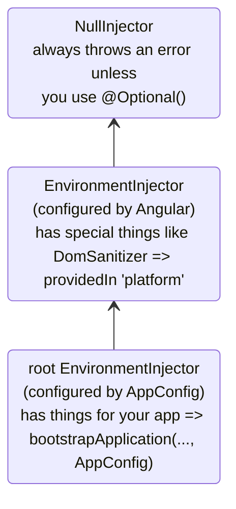
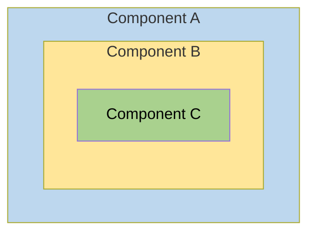
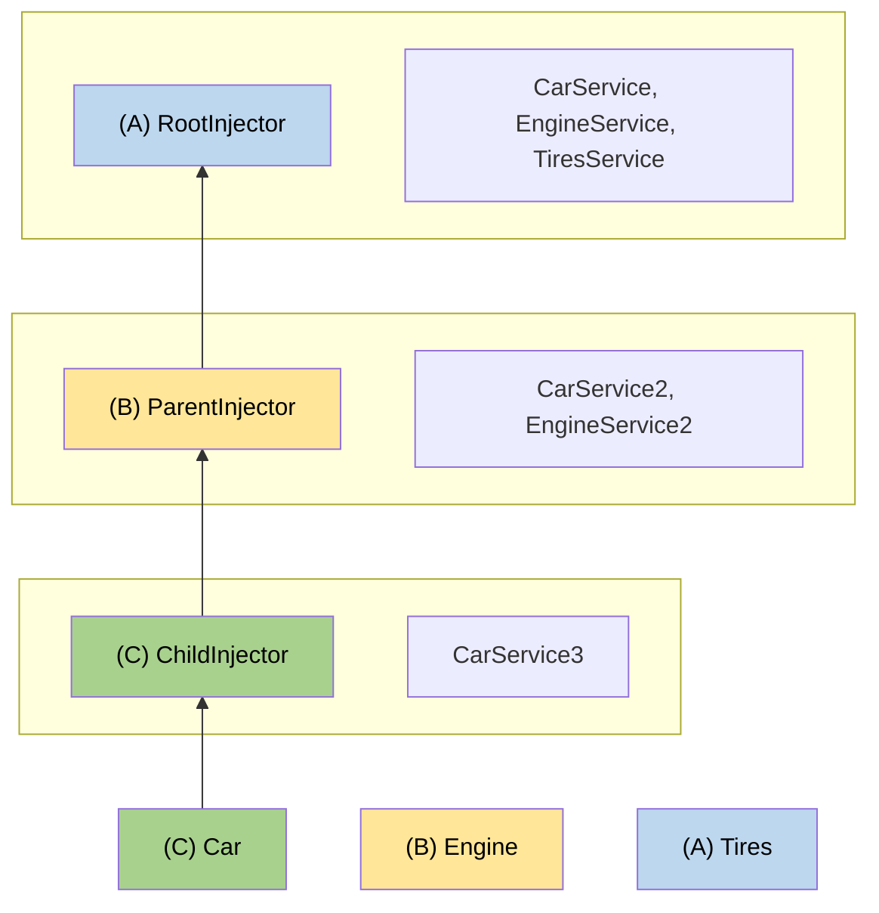

<!-- ia-translate: true -->
# Injectors hierárquicos

Este guia fornece cobertura aprofundada do sistema de dependency injection hierárquico do Angular, incluindo regras de resolução, modificadores e padrões avançados.

NOTA: Para conceitos básicos sobre hierarquia de injector e escopo de provider, veja o [guia de definição de providers de dependência](guide/di/defining-dependency-providers#injector-hierarchy-in-angular).

## Tipos de hierarquias de injector

O Angular tem duas hierarquias de injector:

| Hierarquias de injector         | Detalhes                                                                                                                                                                   |
| :------------------------------ | :------------------------------------------------------------------------------------------------------------------------------------------------------------------------ |
| Hierarquia `EnvironmentInjector` | Configure um `EnvironmentInjector` nesta hierarquia usando `@Injectable()` ou array `providers` em `ApplicationConfig`.                                                   |
| Hierarquia `ElementInjector`     | Criado implicitamente em cada elemento DOM. Um `ElementInjector` é vazio por padrão a menos que você o configure na propriedade `providers` em `@Directive()` ou `@Component()`. |

<docs-callout title="Aplicações Baseadas em NgModule">
Para aplicações baseadas em `NgModule`, você pode fornecer dependências com a hierarquia `ModuleInjector` usando uma anotação `@NgModule()` ou `@Injectable()`.
</docs-callout>

### `EnvironmentInjector`

O `EnvironmentInjector` pode ser configurado de uma das duas maneiras usando:

- A propriedade `providedIn` do `@Injectable()` para se referir a `root` ou `platform`
- O array `providers` do `ApplicationConfig`

<docs-callout title="Tree-shaking e @Injectable()">

Usar a propriedade `providedIn` do `@Injectable()` é preferível a usar o array `providers` do `ApplicationConfig`. Com `@Injectable()` `providedIn`, ferramentas de otimização podem realizar tree-shaking, que remove services que sua aplicação não está usando. Isso resulta em tamanhos de bundle menores.

Tree-shaking é especialmente útil para uma biblioteca porque a aplicação que usa a biblioteca pode não ter necessidade de injetá-la.

</docs-callout>

`EnvironmentInjector` é configurado pelo `ApplicationConfig.providers`.

Forneça services usando `providedIn` do `@Injectable()` da seguinte forma:

```ts {highlight:[4]}
import { Injectable } from '@angular/core';

@Injectable({
  providedIn: 'root' // <--provides this service in the root EnvironmentInjector
})
export class ItemService {
  name = 'telephone';
}
```

O decorator `@Injectable()` identifica uma classe de service.
A propriedade `providedIn` configura um `EnvironmentInjector` específico, aqui `root`, que torna o service disponível no `EnvironmentInjector` `root`.

### ModuleInjector

No caso de aplicações baseadas em `NgModule`, o ModuleInjector pode ser configurado de uma das duas maneiras usando:

- A propriedade `providedIn` do `@Injectable()` para se referir a `root` ou `platform`
- O array `providers` do `@NgModule()`

`ModuleInjector` é configurado pelas propriedades `@NgModule.providers` e `NgModule.imports`. `ModuleInjector` é um achatamento de todos os arrays de providers que podem ser alcançados seguindo `NgModule.imports` recursivamente.

Hierarquias filhas de `ModuleInjector` são criadas ao fazer lazy loading de outros `@NgModules`.

### Platform injector

Existem mais dois injectors acima de `root`, um `EnvironmentInjector` adicional e `NullInjector()`.

Considere como o Angular inicializa a aplicação com o seguinte em `main.ts`:

```ts
bootstrapApplication(AppComponent, appConfig);
```

O método `bootstrapApplication()` cria um injector filho do platform injector que é configurado pela instância `ApplicationConfig`.
Este é o `EnvironmentInjector` `root`.

O método `platformBrowserDynamic()` cria um injector configurado por um `PlatformModule`, que contém dependências específicas da plataforma.
Isso permite que múltiplas aplicações compartilhem uma configuração de plataforma.
Por exemplo, um browser tem apenas uma barra de URL, não importa quantas aplicações você tenha executando.
Você pode configurar providers adicionais específicos da plataforma no nível da plataforma fornecendo `extraProviders` usando a função `platformBrowser()`.

O próximo injector pai na hierarquia é o `NullInjector()`, que é o topo da árvore.
Se você subiu tanto na árvore que está procurando um service no `NullInjector()`, você receberá um erro a menos que tenha usado `@Optional()` porque, em última análise, tudo termina no `NullInjector()` e ele retorna um erro ou, no caso de `@Optional()`, `null`.
Para mais informações sobre `@Optional()`, veja a seção [`@Optional()`](#optional) deste guia.

O diagrama a seguir representa a relação entre o `ModuleInjector` `root` e seus injectors pais conforme os parágrafos anteriores descrevem.



Embora o nome `root` seja um alias especial, outras hierarquias `EnvironmentInjector` não têm aliases.
Você tem a opção de criar hierarquias `EnvironmentInjector` sempre que um component carregado dinamicamente for criado, como com o Router, que criará hierarquias filhas de `EnvironmentInjector`.

Todas as requisições encaminham até o root injector, quer você o tenha configurado com a instância `ApplicationConfig` passada para o método `bootstrapApplication()`, ou registrado todos os providers com `root` em seus próprios services.

<docs-callout title="@Injectable() vs. ApplicationConfig">

Se você configurar um provider em toda a aplicação no `ApplicationConfig` de `bootstrapApplication`, ele sobrescreve um configurado para `root` nos metadados `@Injectable()`.
Você pode fazer isso para configurar um provider não-padrão de um service que é compartilhado com múltiplas aplicações.

Aqui está um exemplo do caso onde a configuração do router de component inclui uma [estratégia de localização](guide/routing#location-strategy) não-padrão listando seu provider na lista `providers` do `ApplicationConfig`.

```ts
providers: [
  { provide: LocationStrategy, useClass: HashLocationStrategy }
]
```

Para aplicações baseadas em `NgModule`, configure providers em toda a aplicação no `AppModule` `providers`.

</docs-callout>

### `ElementInjector`

O Angular cria hierarquias `ElementInjector` implicitamente para cada elemento DOM.

Fornecer um service no decorator `@Component()` usando sua propriedade `providers` ou `viewProviders` configura um `ElementInjector`.
Por exemplo, o seguinte `TestComponent` configura o `ElementInjector` fornecendo o service da seguinte forma:

```ts {highlight:[3]}
@Component({
  /* … */
  providers: [{ provide: ItemService, useValue: { name: 'lamp' } }]
})
export class TestComponent
```

ÚTIL: Veja a seção [regras de resolução](#resolution-rules) para entender a relação entre a árvore `EnvironmentInjector`, o `ModuleInjector` e a árvore `ElementInjector`.

Quando você fornece services em um component, esse service fica disponível através do `ElementInjector` naquela instância de component.
Ele também pode estar visível em components/directives filhos baseado nas regras de visibilidade descritas na seção [regras de resolução](#resolution-rules).

Quando a instância do component é destruída, a instância do service também é.

#### `@Directive()` e `@Component()`

Um component é um tipo especial de directive, o que significa que assim como `@Directive()` tem uma propriedade `providers`, `@Component()` também tem.
Isso significa que directives assim como components podem configurar providers, usando a propriedade `providers`.
Quando você configura um provider para um component ou directive usando a propriedade `providers`, esse provider pertence ao `ElementInjector` daquele component ou directive.
Components e directives no mesmo elemento compartilham um injector.

## Regras de resolução

Ao resolver um token para um component/directive, o Angular o resolve em duas fases:

1. Contra seus pais na hierarquia `ElementInjector`.
2. Contra seus pais na hierarquia `EnvironmentInjector`.

Quando um component declara uma dependência, o Angular tenta satisfazer essa dependência com seu próprio `ElementInjector`.
Se o injector do component não tem o provider, ele passa a requisição para o `ElementInjector` do component pai.

As requisições continuam sendo encaminhadas até que o Angular encontre um injector que possa lidar com a requisição ou fique sem hierarquias ancestrais de `ElementInjector`.

Se o Angular não encontrar o provider em nenhuma hierarquia de `ElementInjector`, ele volta para o elemento onde a requisição se originou e procura na hierarquia `EnvironmentInjector`.
Se o Angular ainda não encontrar o provider, ele lança um erro.

Se você registrou um provider para o mesmo token DI em diferentes níveis, o primeiro que o Angular encontrar é o que ele usa para resolver a dependência.
Se, por exemplo, um provider for registrado localmente no component que precisa de um service,
o Angular não procura por outro provider do mesmo service.

ÚTIL: Para aplicações baseadas em `NgModule`, o Angular procurará na hierarquia `ModuleInjector` se não conseguir encontrar um provider nas hierarquias `ElementInjector`.

## Modificadores de resolução

O comportamento de resolução do Angular pode ser modificado com `optional`, `self`, `skipSelf` e `host`.
Importe cada um deles de `@angular/core` e use cada um na configuração do `inject` quando você injetar seu service.

### Tipos de modificadores

Modificadores de resolução se enquadram em três categorias:

- O que fazer se o Angular não encontrar o que você está procurando, ou seja `optional`
- Onde começar a procurar, ou seja `skipSelf`
- Onde parar de procurar, `host` e `self`

Por padrão, o Angular sempre começa no `Injector` atual e continua procurando até o topo.
Modificadores permitem que você mude a localização inicial, ou _self_, e a localização final.

Além disso, você pode combinar todos os modificadores exceto:

- `host` e `self`
- `skipSelf` e `self`.

### `optional`

`optional` permite ao Angular considerar um service que você injeta como opcional.
Dessa forma, se ele não puder ser resolvido em tempo de execução, o Angular resolve o service como `null`, ao invés de lançar um erro.
No exemplo a seguir, o service, `OptionalService`, não é fornecido no service, `ApplicationConfig`, `@NgModule()`, ou classe de component, então ele não está disponível em nenhum lugar na aplicação.

```ts {header:"src/app/optional/optional.component.ts"}
export class OptionalComponent {
  public optional? = inject(OptionalService, {optional: true});
}
```

### `self`

Use `self` para que o Angular procure apenas no `ElementInjector` do component ou directive atual.

Um bom caso de uso para `self` é injetar um service mas apenas se ele estiver disponível no elemento host atual.
Para evitar erros nesta situação, combine `self` com `optional`.

Por exemplo, no seguinte `SelfNoDataComponent`, observe o `LeafService` injetado como uma propriedade.

```ts {header:"src/app/self-no-data/self-no-data.component.ts", highlight=[7]}>
@Component({
  selector: 'app-self-no-data',
  templateUrl: './self-no-data.component.html',
  styleUrls: ['./self-no-data.component.css']
})
export class SelfNoDataComponent {
  public leaf = inject(LeafService, {optional: true, self: true});
}
```

Neste exemplo, há um provider pai e injetar o service retornará o valor, no entanto, injetar o service com `self` e `optional` retornará `null` porque `self` diz ao injector para parar de procurar no elemento host atual.

Outro exemplo mostra a classe de component com um provider para `FlowerService`.
Neste caso, o injector não procura além do `ElementInjector` atual porque encontra o `FlowerService` e retorna a tulipa 🌷.

```ts {header:"src/app/self/self.component.ts"}
@Component({
  selector: 'app-self',
  templateUrl: './self.component.html',
  styleUrls: ['./self.component.css'],
  providers: [{provide: FlowerService, useValue: {emoji: '🌷'}}],
})
export class SelfComponent {
  constructor(@Self() public flower: FlowerService) {}
}
```

### `skipSelf`

`skipSelf` é o oposto de `self`.
Com `skipSelf`, o Angular inicia sua busca por um service no `ElementInjector` pai, ao invés do atual.
Então, se o `ElementInjector` pai estivesse usando o valor samambaia <code>🌿</code> para `emoji`, mas você tivesse folha de bordo <code>🍁</code> no array `providers` do component, o Angular ignoraria a folha de bordo <code>🍁</code> e usaria samambaia <code>🌿</code>.

Para ver isso em código, assuma que o seguinte valor para `emoji` é o que o component pai estava usando, como neste service:

```ts {header:"src/app/leaf.service.ts"}
export class LeafService {
  emoji = '🌿';
}
```

Imagine que no component filho, você tivesse um valor diferente, folha de bordo 🍁, mas quisesse usar o valor do pai. É quando você usaria `skipSelf`:

```ts {header:"src/app/skipself/skipself.component.ts" highlight:[[6],[10]]}
@Component({
  selector: 'app-skipself',
  templateUrl: './skipself.component.html',
  styleUrls: ['./skipself.component.css'],
  // Angular would ignore this LeafService instance
  providers: [{ provide: LeafService, useValue: { emoji: '🍁' } }]
})
export class SkipselfComponent {
  // Use skipSelf as inject option
  public leaf = inject(LeafService, {skipSelf: true});
}
```

Neste caso, o valor que você obteria para `emoji` seria samambaia <code>🌿</code>, não folha de bordo <code>🍁</code>.

#### Opção `skipSelf` com `optional`

Use a opção `skipSelf` com `optional` para prevenir um erro se o valor for `null`.

No exemplo a seguir, o service `Person` é injetado durante a inicialização da propriedade.
`skipSelf` diz ao Angular para pular o injector atual e `optional` prevenirá um erro caso o service `Person` seja `null`.

```ts
class Person {
  parent = inject(Person, {optional: true, skipSelf: true})
}
```

### `host`

<!-- TODO: Remove ambiguity between host and self. -->

`host` permite que você designe um component como a última parada na árvore de injector ao procurar por providers.

Mesmo se houver uma instância de service mais acima na árvore, o Angular não continuará procurando.
Use `host` da seguinte forma:

```ts {header:"src/app/host/host.component.ts" highlight:[[6],[10]]}
@Component({
selector: 'app-host',
templateUrl: './host.component.html',
styleUrls: ['./host.component.css'],
// provide the service
providers: [{ provide: FlowerService, useValue: { emoji: '🌷' } }]
})
export class HostComponent {
// use host when injecting the service
flower = inject(FlowerService, {host: true, optional: true});
}
```

Como `HostComponent` tem a opção `host`, não importa o que o pai de `HostComponent` possa ter como valor `flower.emoji`, o `HostComponent` usará tulipa <code>🌷</code>.

### Modificadores com injeção via constructor

Similarmente como apresentado antes, o comportamento da injeção via constructor pode ser modificado com `@Optional()`, `@Self()`, `@SkipSelf()` e `@Host()`.

Importe cada um deles de `@angular/core` e use cada um no constructor da classe de component quando você injetar seu service.

```ts {header:"src/app/self-no-data/self-no-data.component.ts" highlight:[3]}
export class SelfNoDataComponent {
  constructor(@Self() @Optional() public leaf?: LeafService) { }
}
```

## Estrutura lógica do template

Quando você fornece services na classe de component, services ficam visíveis dentro da árvore `ElementInjector` relativo a onde e como você fornece esses services.

Entender a estrutura lógica subjacente do template Angular lhe dará uma base para configurar services e, por sua vez, controlar sua visibilidade.

Components são usados em seus templates, como no exemplo a seguir:

```html
<app-root>
  <app-child></app-child>;
</app-root>
```

ÚTIL: Normalmente, você declara os components e seus templates em arquivos separados.
Para os propósitos de entender como o sistema de injeção funciona, é útil olhá-los do ponto de vista de uma árvore lógica combinada.
O termo _lógica_ o distingue da árvore de renderização, que é a árvore DOM da sua aplicação.
Para marcar as localizações de onde os templates de component estão localizados, este guia usa o pseudo-elemento `<#VIEW>`, que não existe realmente na árvore de renderização e está presente apenas para propósitos de modelo mental.

O seguinte é um exemplo de como as árvores de view `<app-root>` e `<app-child>` são combinadas em uma única árvore lógica:

```html
<app-root>
  <#VIEW>
    <app-child>
     <#VIEW>
       …content goes here…
     </#VIEW>
    </app-child>
  </#VIEW>
</app-root>
```

Entender a ideia da demarcação `<#VIEW>` é especialmente significativo quando você configura services na classe de component.

## Exemplo: Fornecendo services em `@Component()`

Como você fornece services usando um decorator `@Component()` (ou `@Directive()`) determina sua visibilidade.
As seções a seguir demonstram `providers` e `viewProviders` juntamente com maneiras de modificar a visibilidade do service com `skipSelf` e `host`.

Uma classe de component pode fornecer services de duas maneiras:

| Arrays                       | Detalhes                                        |
| :--------------------------- | :--------------------------------------------- |
| Com um array `providers`     | `@Component({ providers: [SomeService] })`     |
| Com um array `viewProviders` | `@Component({ viewProviders: [SomeService] })` |

Nos exemplos abaixo, você verá a árvore lógica de uma aplicação Angular.
Para ilustrar como o injector funciona no contexto de templates, a árvore lógica representará a estrutura HTML da aplicação.
Por exemplo, a árvore lógica mostrará que `<child-component>` é um filho direto de `<parent-component>`.

Na árvore lógica, você verá atributos especiais: `@Provide`, `@Inject`, e `@ApplicationConfig`.
Estes não são atributos reais mas estão aqui para demonstrar o que está acontecendo por baixo dos panos.

| Atributo de service Angular | Detalhes                                                                                  |
| :------------------------ | :--------------------------------------------------------------------------------------- |
| `@Inject(Token)=>Value`   | Se `Token` for injetado nesta localização na árvore lógica, seu valor seria `Value`. |
| `@Provide(Token=Value)`   | Indica que `Token` é fornecido com `Value` nesta localização na árvore lógica.    |
| `@ApplicationConfig`      | Demonstra que um `EnvironmentInjector` de fallback deve ser usado nesta localização.      |

### Estrutura de aplicação de exemplo

A aplicação de exemplo tem um `FlowerService` fornecido em `root` com um valor `emoji` de hibisco vermelho <code>🌺</code>.

```ts {header:"src/app/flower.service.ts"}
@Injectable({
  providedIn: 'root'
})
export class FlowerService {
  emoji = '🌺';
}
```

Considere uma aplicação com apenas um `AppComponent` e um `ChildComponent`.
A view renderizada mais básica seria como elementos HTML aninhados como o seguinte:

```html
<app-root> <!-- AppComponent selector -->
<app-child> <!-- ChildComponent selector -->
</app-child>
</app-root>
```

No entanto, nos bastidores, o Angular usa uma representação lógica de view da seguinte forma ao resolver requisições de injeção:

```html
<app-root> <!-- AppComponent selector -->
  <#VIEW>
    <app-child> <!-- ChildComponent selector -->
      <#VIEW>
      </#VIEW>
    </app-child>
  </#VIEW>
</app-root>
```

O `<#VIEW>` aqui representa uma instância de um template.
Observe que cada component tem seu próprio `<#VIEW>`.

Conhecimento desta estrutura pode informar como você fornece e injeta seus services, e lhe dar controle completo da visibilidade do service.

Agora, considere que `<app-root>` injeta o `FlowerService`:

```typescript
export class AppComponent  {
  flower = inject(FlowerService);
}
```

Adicione um binding ao template `<app-root>` para visualizar o resultado:

```html
<p>Emoji from FlowerService: {{flower.emoji}}</p>
```

A saída na view seria:

```shell
Emoji from FlowerService: 🌺
```

Na árvore lógica, isso seria representado da seguinte forma:

```html
<app-root @ApplicationConfig
        @Inject(FlowerService) flower=>"🌺">
  <#VIEW>
    <p>Emoji from FlowerService: {{flower.emoji}} (🌺)</p>
    <app-child>
      <#VIEW>
      </#VIEW>
    </app-child>
  </#VIEW>
</app-root>
```

Quando `<app-root>` solicita o `FlowerService`, é trabalho do injector resolver o token `FlowerService`.
A resolução do token acontece em duas fases:

1. O injector determina a localização inicial na árvore lógica e uma localização final da busca.
   O injector começa com a localização inicial e procura pelo token em cada nível de view na árvore lógica.
   Se o token for encontrado, ele é retornado.

1. Se o token não for encontrado, o injector procura pelo `EnvironmentInjector` pai mais próximo para delegar a requisição.

No caso de exemplo, as restrições são:

1. Comece com `<#VIEW>` pertencente a `<app-root>` e termine com `<app-root>`.
   - Normalmente o ponto inicial para busca é no ponto de injeção.
     No entanto, neste caso `<app-root>` é um component. `@Component`s são especiais pois também incluem seus próprios `viewProviders`, que é por isso que a busca começa em `<#VIEW>` pertencente a `<app-root>`.
     Este não seria o caso para uma directive correspondida na mesma localização.
   - A localização final acontece de ser a mesma que o próprio component, porque é o component mais alto nesta aplicação.

1. O `EnvironmentInjector` fornecido pelo `ApplicationConfig` atua como o injector de fallback quando o token de injeção não pode ser encontrado nas hierarquias `ElementInjector`.

### Usando o array `providers`

Agora, na classe `ChildComponent`, adicione um provider para `FlowerService` para demonstrar regras de resolução mais complexas nas próximas seções:

```typescript
@Component({
selector: 'app-child',
templateUrl: './child.component.html',
styleUrls: ['./child.component.css'],
// use the providers array to provide a service
providers: [{ provide: FlowerService, useValue: { emoji: '🌻' } }]
})
export class ChildComponent {
// inject the service
flower = inject(FlowerService);
}
```

Agora que o `FlowerService` é fornecido no decorator `@Component()`, quando o `<app-child>` solicita o service, o injector tem apenas que procurar até o `ElementInjector` no `<app-child>`.
Ele não terá que continuar a busca através da árvore de injector.

O próximo passo é adicionar um binding ao template `ChildComponent`.

```html
<p>Emoji from FlowerService: {{flower.emoji}}</p>
```

Para renderizar os novos valores, adicione `<app-child>` no final do template `AppComponent` para que a view também exiba o girassol:

```shell
Child Component
Emoji from FlowerService: 🌻
```

Na árvore lógica, isso é representado da seguinte forma:

```html
<app-root @ApplicationConfig
@Inject(FlowerService) flower=>"🌺">
<#VIEW>

<p>Emoji from FlowerService: {{flower.emoji}} (🌺)</p>
<app-child @Provide(FlowerService="🌻")
@Inject(FlowerService)=>"🌻"> <!-- search ends here -->
<#VIEW> <!-- search starts here -->
<h2>Child Component</h2>
<p>Emoji from FlowerService: {{flower.emoji}} (🌻)</p>
</#VIEW>
</app-child>
</#VIEW>
</app-root>
```

Quando `<app-child>` solicita o `FlowerService`, o injector começa sua busca no `<#VIEW>` pertencente a `<app-child>` \(`<#VIEW>` é incluído porque é injetado de `@Component()`\) e termina com `<app-child>`.
Neste caso, o `FlowerService` é resolvido no array `providers` com girassol <code>🌻</code> do `<app-child>`.
O injector não tem que procurar mais adiante na árvore de injector.
Ele para assim que encontra o `FlowerService` e nunca vê o hibisco vermelho <code>🌺</code>.

### Usando o array `viewProviders`

Use o array `viewProviders` como outra maneira de fornecer services no decorator `@Component()`.
Usar `viewProviders` torna services visíveis no `<#VIEW>`.

ÚTIL: Os passos são os mesmos que usar o array `providers`, com a exceção de usar o array `viewProviders`.

Para instruções passo a passo, continue com esta seção.
Se você conseguir configurá-lo sozinho, pule para [Modificando disponibilidade de service](#visibility-of-provided-tokens).

Para demonstração, estamos construindo um `AnimalService` para demonstrar `viewProviders`.
Primeiro, crie um `AnimalService` com uma propriedade `emoji` de baleia <code>🐳</code>:

```typescript
import { Injectable } from '@angular/core';

@Injectable({
providedIn: 'root'
})
export class AnimalService {
emoji = '🐳';
}
```

Seguindo o mesmo padrão que com o `FlowerService`, injete o `AnimalService` na classe `AppComponent`:

```typescript
export class AppComponent {
    public flower = inject(FlowerService);
    public animal = inject(AnimalService);
}
```

ÚTIL: Você pode deixar todo o código relacionado ao `FlowerService` no lugar pois permitirá uma comparação com o `AnimalService`.

Adicione um array `viewProviders` e injete o `AnimalService` na classe `<app-child>` também, mas dê ao `emoji` um valor diferente.
Aqui, ele tem um valor de cachorro 🐶.

```typescript
@Component({
selector: 'app-child',
templateUrl: './child.component.html',
styleUrls: ['./child.component.css'],
// provide services
providers: [{ provide: FlowerService, useValue: { emoji: '🌻' } }],
viewProviders: [{ provide: AnimalService, useValue: { emoji: '🐶' } }]
})
export class ChildComponent {
// inject services
flower = inject(FlowerService);
animal = inject(AnimalService)
...
}
```

Adicione bindings aos templates `ChildComponent` e `AppComponent`.
No template `ChildComponent`, adicione o seguinte binding:

```html
<p>Emoji from AnimalService: {{animal.emoji}}</p>
```

Adicionalmente, adicione o mesmo ao template `AppComponent`:

```html
<p>Emoji from AnimalService: {{animal.emoji}}</p>s
```

Agora você deve ver ambos os valores no browser:

```shell
AppComponent
Emoji from AnimalService: 🐳

Child Component
Emoji from AnimalService: 🐶
```

A árvore lógica para este exemplo de `viewProviders` é a seguinte:

```html
<app-root @ApplicationConfig
@Inject(AnimalService) animal=>"🐳">
<#VIEW>
<app-child>
<#VIEW @Provide(AnimalService="🐶")
@Inject(AnimalService=>"🐶")>

<!-- ^^using viewProviders means AnimalService is available in <#VIEW>-->
<p>Emoji from AnimalService: {{animal.emoji}} (🐶)</p>
</#VIEW>
</app-child>
</#VIEW>
</app-root>
```

Assim como com o exemplo `FlowerService`, o `AnimalService` é fornecido no decorator `@Component()` do `<app-child>`.
Isso significa que, uma vez que o injector primeiro procura no `ElementInjector` do component, ele encontra o valor `AnimalService` de cachorro <code>🐶</code>.
Ele não precisa continuar procurando na árvore `ElementInjector`, nem precisa procurar no `ModuleInjector`.

### `providers` vs. `viewProviders`

O campo `viewProviders` é conceitualmente similar a `providers`, mas há uma diferença notável.
Providers configurados em `viewProviders` não são visíveis para conteúdo projetado que acaba como filho lógico do component.

Para ver a diferença entre usar `providers` e `viewProviders`, adicione outro component ao exemplo e chame-o de `InspectorComponent`.
`InspectorComponent` será um filho do `ChildComponent`.
Em `inspector.component.ts`, injete o `FlowerService` e `AnimalService` durante a inicialização da propriedade:

```typescript
export class InspectorComponent {
  flower = inject(FlowerService);
  animal = inject(AnimalService);
}
```

Você não precisa de um array `providers` ou `viewProviders`.
A seguir, em `inspector.component.html`, adicione a mesma marcação dos components anteriores:

```html
<p>Emoji from FlowerService: {{flower.emoji}}</p>
<p>Emoji from AnimalService: {{animal.emoji}}</p>
```

Lembre-se de adicionar o `InspectorComponent` ao array `imports` do `ChildComponent`.

```typescript
@Component({
...
imports: [InspectorComponent]
})
```

A seguir, adicione o seguinte a `child.component.html`:

```html
...

<div class="container">
  <h3>Content projection</h3>
  <ng-content></ng-content>
</div>
<h3>Inside the view</h3>

<app-inspector></app-inspector>
```

`<ng-content>` permite que você projete conteúdo, e `<app-inspector>` dentro do template `ChildComponent` torna o `InspectorComponent` um component filho de `ChildComponent`.

A seguir, adicione o seguinte a `app.component.html` para aproveitar a projeção de conteúdo.

```html
<app-child>
  <app-inspector></app-inspector>
</app-child>
```

O browser agora renderiza o seguinte, omitindo os exemplos anteriores para brevidade:

```shell
...
Content projection

Emoji from FlowerService: 🌻
Emoji from AnimalService: 🐳

Emoji from FlowerService: 🌻
Emoji from AnimalService: 🐶
```

Esses quatro bindings demonstram a diferença entre `providers` e `viewProviders`.
Lembre-se de que o emoji de cachorro <code>🐶</code> é declarado dentro do `<#VIEW>` de `ChildComponent` e não é visível para o conteúdo projetado.
Em vez disso, o conteúdo projetado vê a baleia <code>🐳</code>.

No entanto, na próxima seção de saída, o `InspectorComponent` é um component filho real de `ChildComponent`, `InspectorComponent` está dentro do `<#VIEW>`, então quando ele pede o `AnimalService`, ele vê o cachorro <code>🐶</code>.

O `AnimalService` na árvore lógica seria assim:

```html
<app-root @ApplicationConfig
@Inject(AnimalService) animal=>"🐳">
<#VIEW>
<app-child>
<#VIEW @Provide(AnimalService="🐶")
@Inject(AnimalService=>"🐶")>

<!-- ^^using viewProviders means AnimalService is available in <#VIEW>-->
<p>Emoji from AnimalService: {{animal.emoji}} (🐶)</p>

        <div class="container">
          <h3>Content projection</h3>
          <app-inspector @Inject(AnimalService) animal=>"🐳">
            <p>Emoji from AnimalService: {{animal.emoji}} (🐳)</p>
          </app-inspector>
        </div>

        <app-inspector>
          <#VIEW @Inject(AnimalService) animal=>"🐶">
            <p>Emoji from AnimalService: {{animal.emoji}} (🐶)</p>
          </#VIEW>
        </app-inspector>
      </#VIEW>
    </app-child>

</#VIEW>
</app-root>
```

O conteúdo projetado de `<app-inspector>` vê a baleia <code>🐳</code>, não o cachorro <code>🐶</code>, porque o cachorro <code>🐶</code> está dentro do `<#VIEW>` do `<app-child>`.
O `<app-inspector>` só pode ver o cachorro <code>🐶</code> se também estiver dentro do `<#VIEW>`.

### Visibilidade de tokens fornecidos

Decorators de visibilidade influenciam onde a busca pelo token de injeção começa e termina na árvore lógica.
Para fazer isso, coloque a configuração de visibilidade no ponto de injeção, ou seja, ao invocar `inject()`, ao invés de em um ponto de declaração.

Para alterar onde o injector começa a procurar por `FlowerService`, adicione `skipSelf` à invocação `inject()` do `<app-child>` onde `FlowerService` é injetado.
Esta invocação é um inicializador de propriedade do `<app-child>` como mostrado em `child.component.ts`:

```typescript
flower = inject(FlowerService, { skipSelf: true })
```

Com `skipSelf`, o injector `<app-child>` não procura em si mesmo pelo `FlowerService`.
Em vez disso, o injector começa a procurar pelo `FlowerService` no `ElementInjector` do `<app-root>`, onde não encontra nada.
Então, ele volta para o `ModuleInjector` do `<app-child>` e encontra o valor hibisco vermelho <code>🌺</code>, que está disponível porque `<app-child>` e `<app-root>` compartilham o mesmo `ModuleInjector`.
A UI renderiza o seguinte:

```shell
Emoji from FlowerService: 🌺
```

Em uma árvore lógica, esta mesma ideia pode parecer assim:

```html
<app-root @ApplicationConfig
@Inject(FlowerService) flower=>"🌺">
<#VIEW>
<app-child @Provide(FlowerService="🌻")>
<#VIEW @Inject(FlowerService, SkipSelf)=>"🌺">

<!-- With SkipSelf, the injector looks to the next injector up the tree (app-root) -->

</#VIEW>
</app-child>
</#VIEW>
</app-root>
```

Embora `<app-child>` forneça o girassol <code>🌻</code>, a aplicação renderiza o hibisco vermelho <code>🌺</code> porque `skipSelf` faz com que o injector atual (`app-child`) se pule e procure em seu pai.

Se você agora adicionar `host` (além do `skipSelf`), o resultado será `null`.
Isso é porque `host` limita o limite superior da busca ao `<#VIEW>` do `app-child`.
Aqui está a ideia na árvore lógica:

```html
<app-root @ApplicationConfig
@Inject(FlowerService) flower=>"🌺">
<#VIEW> <!-- end search here with null-->
<app-child @Provide(FlowerService="🌻")> <!-- start search here -->
<#VIEW inject(FlowerService, {skipSelf: true, host: true, optional:true})=>null>
</#VIEW>
</app-parent>
</#VIEW>
</app-root>
```

Aqui, os services e seus valores são os mesmos, mas `host` impede o injector de procurar além do `<#VIEW>` por `FlowerService`, então ele não o encontra e retorna `null`.

### `skipSelf` e `viewProviders`

Lembre-se, `<app-child>` fornece o `AnimalService` no array `viewProviders` com o valor de cachorro <code>🐶</code>.
Como o injector tem apenas que procurar no `ElementInjector` do `<app-child>` pelo `AnimalService`, ele nunca vê a baleia <code>🐳</code>.

Como no exemplo `FlowerService`, se você adicionar `skipSelf` ao `inject()` de `AnimalService`, o injector não procurará no `ElementInjector` do `<app-child>` atual pelo `AnimalService`.
Em vez disso, o injector começará no `ElementInjector` do `<app-root>`.

```typescript
@Component({
  selector: 'app-child',
  …
  viewProviders: [
    { provide: AnimalService, useValue: { emoji: '🐶' } },
  ],
})
```

A árvore lógica se parece com isso com `skipSelf` em `<app-child>`:

```html
<app-root @ApplicationConfig
@Inject(AnimalService=>"🐳")>
<#VIEW><!-- search begins here -->
<app-child>
<#VIEW @Provide(AnimalService="🐶")
@Inject(AnimalService, SkipSelf=>"🐳")>

<!--Add skipSelf -->

</#VIEW>
</app-child>
</#VIEW>
</app-root>
```

Com `skipSelf` no `<app-child>`, o injector começa sua busca pelo `AnimalService` no `ElementInjector` do `<app-root>` e encontra baleia 🐳.

### `host` e `viewProviders`

Se você apenas usar `host` para a injeção de `AnimalService`, o resultado é cachorro <code>🐶</code> porque o injector encontra o `AnimalService` no próprio `<#VIEW>` do `<app-child>`.
O `ChildComponent` configura os `viewProviders` para que o emoji de cachorro seja fornecido como valor `AnimalService`.
Você também pode ver `host` no `inject()`:

```typescript
@Component({
  selector: 'app-child',
  …
  viewProviders: [
    { provide: AnimalService, useValue: { emoji: '🐶' } },
  ]
})
export class ChildComponent {
  animal = inject(AnimalService, { host: true })
}
```

`host: true` faz com que o injector procure até encontrar a borda do `<#VIEW>`.

```html
<app-root @ApplicationConfig
@Inject(AnimalService=>"🐳")>
<#VIEW>
<app-child>
<#VIEW @Provide(AnimalService="🐶")
inject(AnimalService, {host: true}=>"🐶")> <!-- host stops search here -->
</#VIEW>
</app-child>
</#VIEW>
</app-root>
```

Adicione um array `viewProviders` com um terceiro animal, ouriço <code>🦔</code>, aos metadados `@Component()` do `app.component.ts`:

```typescript
@Component({
  selector: 'app-root',
  templateUrl: './app.component.html',
  styleUrls: [ './app.component.css' ],
  viewProviders: [
    { provide: AnimalService, useValue: { emoji: '🦔' } },
  ],
})
```

A seguir, adicione `skipSelf` junto com `host` ao `inject()` para a injeção de `AnimalService` em `child.component.ts`.
Aqui estão `host` e `skipSelf` na inicialização da propriedade `animal`:

```typescript
export class ChildComponent {
  animal = inject(AnimalService, { host: true, skipSelf: true });
}
```

<!-- TODO: This requires a rework. It seems not well explained what `viewProviders`/`injectors` is here
  and how `host` works.
 -->

Quando `host` e `skipSelf` foram aplicados ao `FlowerService`, que está no array `providers`, o resultado foi `null` porque `skipSelf` inicia sua busca no injector `<app-child>`, mas `host` para de procurar em `<#VIEW>` —onde não há `FlowerService`
Na árvore lógica, você pode ver que o `FlowerService` é visível em `<app-child>`, não em seu `<#VIEW>`.

No entanto, o `AnimalService`, que é fornecido no array `viewProviders` do `AppComponent`, é visível.

A representação da árvore lógica mostra por que isso acontece:

```html
<app-root @ApplicationConfig
@Inject(AnimalService=>"🐳")>
<#VIEW @Provide(AnimalService="🦔")
@Inject(AnimalService, @Optional)=>"🦔">

<!-- ^^skipSelf starts here,  host stops here^^ -->
<app-child>
<#VIEW @Provide(AnimalService="🐶")
inject(AnimalService, {skipSelf:true, host: true, optional: true})=>"🦔">
<!-- Add skipSelf ^^-->
</#VIEW>
</app-child>
</#VIEW>
</app-root>
```

`skipSelf`, faz com que o injector inicie sua busca pelo `AnimalService` no `<app-root>`, não no `<app-child>`, onde a requisição se origina, e `host` para a busca no `<#VIEW>` do `<app-root>`.
Como `AnimalService` é fornecido através do array `viewProviders`, o injector encontra ouriço <code>🦔</code> no `<#VIEW>`.

## Exemplo: casos de uso de `ElementInjector`

A habilidade de configurar um ou mais providers em diferentes níveis abre possibilidades úteis.

### Cenário: isolamento de service

Razões arquiteturais podem levá-lo a restringir acesso a um service ao domínio da aplicação onde ele pertence.
Por exemplo, considere que construímos um `VillainsListComponent` que exibe uma lista de vilões.
Ele obtém esses vilões de um `VillainsService`.

Se você fornecer `VillainsService` no `AppModule` raiz, ele tornará `VillainsService` visível em todos os lugares na aplicação.
Se você posteriormente modificar o `VillainsService`, você poderia quebrar algo em outros components que começaram a depender deste service por acidente.

Em vez disso, você deve fornecer o `VillainsService` nos metadados `providers` do `VillainsListComponent` assim:

```typescript
@Component({
selector: 'app-villains-list',
templateUrl: './villains-list.component.html',
providers: [VillainsService]
})
export class VillainsListComponent {}
```

Ao fornecer `VillainsService` nos metadados `VillainsListComponent` e em nenhum outro lugar, o service torna-se disponível apenas no `VillainsListComponent` e sua subárvore de components.

`VillainService` é um singleton com respeito a `VillainsListComponent` porque é onde ele é declarado.
Contanto que `VillainsListComponent` não seja destruído, será a mesma instância de `VillainService`, mas se houver múltiplas instâncias de `VillainsListComponent`, então cada instância de `VillainsListComponent` terá sua própria instância de `VillainService`.

### Cenário: múltiplas sessões de edição

Muitas aplicações permitem que usuários trabalhem em várias tarefas abertas ao mesmo tempo.
Por exemplo, em uma aplicação de preparação de impostos, o preparador poderia estar trabalhando em várias declarações fiscais, alternando de uma para outra ao longo do dia.

Para demonstrar esse cenário, imagine um `HeroListComponent` que exibe uma lista de super-heróis.

Para abrir a declaração fiscal de um herói, o preparador clica em um nome de herói, que abre um component para editar aquela declaração.
Cada declaração fiscal de herói selecionado abre em seu próprio component e múltiplas declarações podem estar abertas ao mesmo tempo.

Cada component de declaração fiscal tem as seguintes características:

- É sua própria sessão de edição de declaração fiscal
- Pode alterar uma declaração fiscal sem afetar uma declaração em outro component
- Tem a habilidade de salvar as mudanças em sua declaração fiscal ou cancelá-las

Suponha que o `HeroTaxReturnComponent` tivesse lógica para gerenciar e restaurar mudanças.
Isso seria uma tarefa direta para uma declaração fiscal de herói.
No mundo real, com um modelo de dados de declaração fiscal rico, o gerenciamento de mudanças seria complicado.
Você poderia delegar esse gerenciamento a um service auxiliar, como este exemplo faz.

O `HeroTaxReturnService` armazena em cache um único `HeroTaxReturn`, rastreia mudanças naquela declaração e pode salvá-la ou restaurá-la.
Ele também delega ao singleton `HeroService` em toda a aplicação, que ele obtém por injeção.

```typescript
import { Injectable } from '@angular/core';
import { HeroTaxReturn } from './hero';
import { HeroesService } from './heroes.service';

@Injectable()
export class HeroTaxReturnService {
private currentTaxReturn!: HeroTaxReturn;
private originalTaxReturn!: HeroTaxReturn;

private heroService = inject(HeroesService);

set taxReturn(htr: HeroTaxReturn) {
this.originalTaxReturn = htr;
this.currentTaxReturn = htr.clone();
}

get taxReturn(): HeroTaxReturn {
return this.currentTaxReturn;
}

restoreTaxReturn() {
this.taxReturn = this.originalTaxReturn;
}

saveTaxReturn() {
this.taxReturn = this.currentTaxReturn;
this.heroService.saveTaxReturn(this.currentTaxReturn).subscribe();
}
}
```

Aqui está o `HeroTaxReturnComponent` que faz uso de `HeroTaxReturnService`.

```typescript
import { Component, EventEmitter, input, output } from '@angular/core';
import { HeroTaxReturn } from './hero';
import { HeroTaxReturnService } from './hero-tax-return.service';

@Component({
selector: 'app-hero-tax-return',
templateUrl: './hero-tax-return.component.html',
styleUrls: [ './hero-tax-return.component.css' ],
providers: [ HeroTaxReturnService ]
})
export class HeroTaxReturnComponent {
message = '';

close = output<void>();

get taxReturn(): HeroTaxReturn {
return this.heroTaxReturnService.taxReturn;
}

taxReturn = input.required<HeroTaxReturn>();

constructor() {
effect(() => {
this.heroTaxReturnService.taxReturn = this.taxReturn();
})
}

private heroTaxReturnService = inject(HeroTaxReturnService);

onCanceled() {
this.flashMessage('Canceled');
this.heroTaxReturnService.restoreTaxReturn();
}

onClose() { this.close.emit(); }

onSaved() {
this.flashMessage('Saved');
this.heroTaxReturnService.saveTaxReturn();
}

flashMessage(msg: string) {
this.message = msg;
setTimeout(() => this.message = '', 500);
}
}
```

A _tax-return-to-edit_ chega através da propriedade `input`, que é implementada com getters e setters.
O setter inicializa a própria instância do component do `HeroTaxReturnService` com a declaração recebida.
O getter sempre retorna o que aquele service diz que é o estado atual do herói.
O component também pede ao service para salvar e restaurar esta declaração fiscal.

Isso não funcionará se o service for um singleton em toda a aplicação.
Cada component compartilharia a mesma instância de service, e cada component sobrescreveria a declaração fiscal que pertenceu a outro herói.

Para evitar isso, configure o injector de nível de component de `HeroTaxReturnComponent` para fornecer o service, usando a propriedade `providers` nos metadados do component.

```typescript
providers: [HeroTaxReturnService]
```

O `HeroTaxReturnComponent` tem seu próprio provider do `HeroTaxReturnService`.
Lembre-se que cada _instância_ de component tem seu próprio injector.
Fornecer o service no nível do component garante que _cada_ instância do component obtenha uma instância privada do service. Isso garante que nenhuma declaração fiscal seja sobrescrita.

ÚTIL: O resto do código do cenário depende de outros recursos e técnicas do Angular que você pode aprender em outros lugares na documentação.

### Cenário: providers especializados

Outra razão para fornecer um service novamente em outro nível é substituir uma implementação _mais especializada_ daquele service, mais profundamente na árvore de components.

Por exemplo, considere um component `Car` que inclui informações de serviço de pneus e depende de outros services para fornecer mais detalhes sobre o carro.

O injector raiz, marcado como (A), usa providers _genéricos_ para detalhes sobre `CarService` e `EngineService`.

1. Component `Car` (A). Component (A) exibe dados de serviço de pneus sobre um carro e especifica services genéricos para fornecer mais informações sobre o carro.

2. Component filho (B). Component (B) define seus próprios providers _especializados_ para `CarService` e `EngineService` que têm capacidades especiais adequadas para o que está acontecendo no component (B).

3. Component filho (C) como filho do Component (B). Component (C) define seu próprio provider ainda _mais especializado_ para `CarService`.



Nos bastidores, cada component configura seu próprio injector com zero, um ou mais providers definidos para aquele próprio component.

Quando você resolve uma instância de `Car` no component mais profundo (C), seu injector produz:

- Uma instância de `Car` resolvida pelo injector (C)
- Um `Engine` resolvido pelo injector (B)
- Seus `Tires` resolvidos pelo injector raiz (A).



## Mais sobre dependency injection

<docs-pill-row>
  <docs-pill href="/guide/di/dependency-injection-providers" title="DI Providers"/>
</docs-pill-row>
