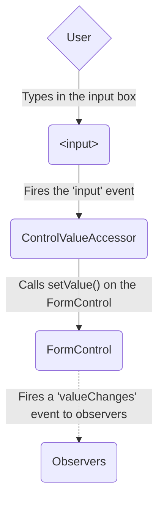
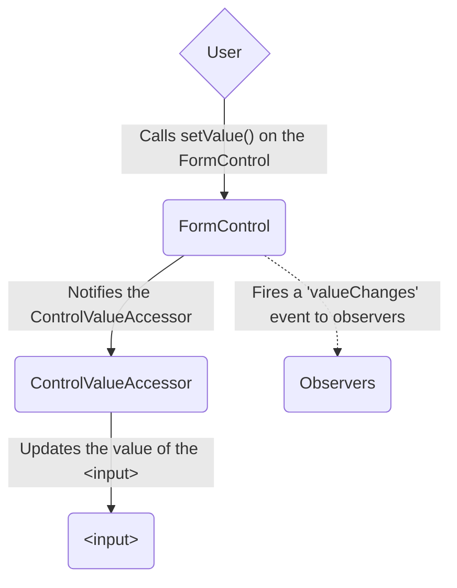
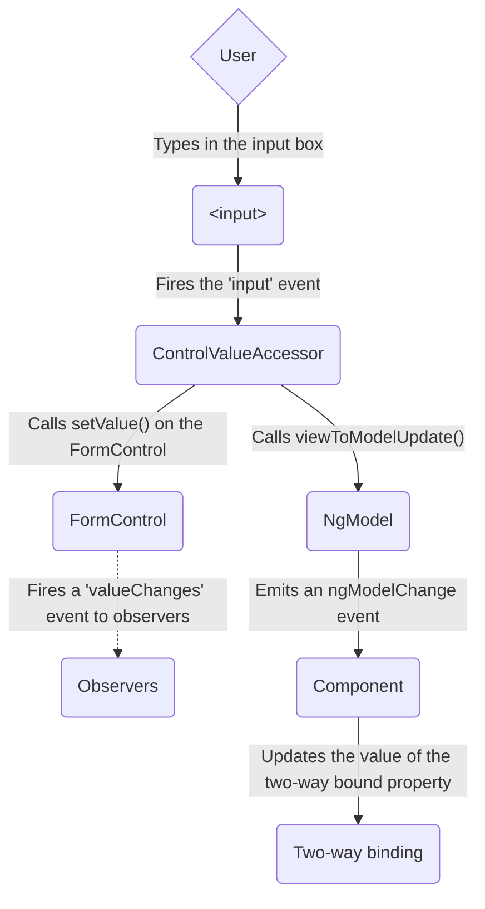
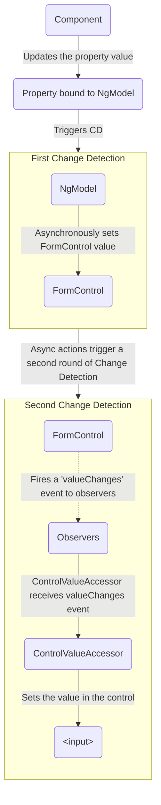

<!-- ia-translate: true -->

<docs-decorative-header title="Forms in Angular" imgSrc="adev/src/assets/images/overview.svg"> <!-- markdownlint-disable-line -->
Lidar com entrada de usuário por meio de forms é a base de muitas aplicações comuns.
</docs-decorative-header>

As aplicações usam forms para permitir que os usuários façam login, atualizem um perfil, insiram informações sensíveis e realizem muitas outras tarefas de entrada de dados.

O Angular fornece duas abordagens diferentes para lidar com entrada de usuário por meio de forms: reactive e template-driven.

Ambas capturam eventos de entrada de usuário da view, validam a entrada do usuário, criam um form model e um data model para atualização, e fornecem uma maneira de rastrear mudanças.

TIP: Se você está procurando os novos Signal Forms experimentais, confira nosso [guia essencial de Signal Forms](/essentials/signal-forms)!

Este guia fornece informações para ajudá-lo a decidir qual tipo de form funciona melhor para sua situação.
Ele introduz os blocos de construção comuns usados por ambas as abordagens.
Ele também resume as principais diferenças entre as duas abordagens e demonstra essas diferenças no contexto de configuração, fluxo de dados e testes.

## Escolhendo uma abordagem

Reactive forms e template-driven forms processam e gerenciam dados de formulário de maneira diferente.
Cada abordagem oferece vantagens diferentes.

| Forms                 | Detalhes                                                                                                                                                                                                                                                                                                                                                                                                                                                                    |
| :-------------------- | :-------------------------------------------------------------------------------------------------------------------------------------------------------------------------------------------------------------------------------------------------------------------------------------------------------------------------------------------------------------------------------------------------------------------------------------------------------------------------- |
| Reactive forms        | Fornecem acesso direto e explícito ao modelo de objeto subjacente do form. Comparados aos template-driven forms, eles são mais robustos: são mais escaláveis, reutilizáveis e testáveis. Se forms são uma parte fundamental da sua aplicação, ou se você já está usando padrões reativos para construir sua aplicação, use reactive forms.                                                                                                                                  |
| Template-driven forms | Dependem de directives no template para criar e manipular o modelo de objeto subjacente. Eles são úteis para adicionar um form simples a uma aplicação, como um formulário de inscrição em uma lista de e-mails. Eles são diretos para adicionar a uma aplicação, mas não escalam tão bem quanto reactive forms. Se você tem requisitos e lógica de formulário muito básicos que podem ser gerenciados apenas no template, template-driven forms podem ser uma boa escolha. |

### Diferenças principais {#data-flow-in-forms}

A tabela a seguir resume as principais diferenças entre reactive e template-driven forms.

|                                                          | Reactive                                 | Template-driven                  |
| :------------------------------------------------------- | :--------------------------------------- | :------------------------------- |
| [Configuração do form model](#setting-up-the-form-model) | Explícita, criada na classe do component | Implícita, criada por directives |
| [Data model](#mutability-of-the-data-model)              | Estruturado e imutável                   | Não estruturado e mutável        |
| [Fluxo de dados](#data-flow-in-forms)                    | Síncrono                                 | Assíncrono                       |
| [Validação de formulário](#form-validation)              | Functions                                | Directives                       |

### Escalabilidade {#form-validation}

Se forms são uma parte central da sua aplicação, a escalabilidade é muito importante.
Ser capaz de reutilizar form models através de components é crítico.

Reactive forms são mais escaláveis do que template-driven forms.
Eles fornecem acesso direto à API subjacente do formulário e usam [fluxo de dados síncrono](#data-flow-in-reactive-forms) entre a view e o data model, o que torna a criação de formulários em larga escala mais fácil.
Reactive forms requerem menos configuração para testes, e os testes não exigem compreensão profunda da detecção de mudanças para testar adequadamente atualizações e validação de formulários.

Template-driven forms focam em cenários simples e não são tão reutilizáveis.
Eles abstraem a API subjacente do formulário e usam [fluxo de dados assíncrono](#data-flow-in-template-driven-forms) entre a view e o data model.
A abstração dos template-driven forms também afeta os testes.
Os testes dependem fortemente da execução manual de detecção de mudanças para funcionar corretamente e requerem mais configuração.

## Configurando o form model {#setting-up-the-form-model}

Tanto reactive quanto template-driven forms rastreiam mudanças de valor entre os elementos de entrada de formulário com os quais os usuários interagem e os dados de formulário no modelo do seu component.
As duas abordagens compartilham blocos de construção subjacentes, mas diferem em como você cria e gerencia as instâncias comuns de form-control.

### Classes fundamentais comuns de formulário

Tanto reactive quanto template-driven forms são construídos nas seguintes classes base.

| Classes base           | Detalhes                                                                             |
| :--------------------- | :----------------------------------------------------------------------------------- |
| `FormControl`          | Rastreia o valor e o status de validação de um form control individual.              |
| `FormGroup`            | Rastreia os mesmos valores e status para uma coleção de form controls.               |
| `FormArray`            | Rastreia os mesmos valores e status para um array de form controls.                  |
| `ControlValueAccessor` | Cria uma ponte entre as instâncias Angular `FormControl` e os elementos DOM nativos. |

### Configuração em reactive forms {#data-flow-in-reactive-forms}

Com reactive forms, você define o form model diretamente na classe do component.
A directive `[formControl]` vincula a instância `FormControl` explicitamente criada a um elemento de formulário específico na view, usando um value accessor interno.

O component a seguir implementa um campo de entrada para um único control, usando reactive forms.
Neste exemplo, o form model é a instância `FormControl`.

<docs-code language="angular-ts" path="adev/src/content/examples/forms-overview/src/app/reactive/favorite-color/favorite-color.component.ts"/>

IMPORTANT: Em reactive forms, o form model é a fonte da verdade; ele fornece o valor e o status do elemento de formulário em qualquer momento, através da directive `[formControl]` no elemento `<input>`.

### Configuração em template-driven forms {#data-flow-in-template-driven-forms}

Em template-driven forms, o form model é implícito, em vez de explícito.
A directive `NgModel` cria e gerencia uma instância `FormControl` para um determinado elemento de formulário.

O component a seguir implementa o mesmo campo de entrada para um único control, usando template-driven forms.

<docs-code language="angular-ts" path="adev/src/content/examples/forms-overview/src/app/template/favorite-color/favorite-color.component.ts"/>

IMPORTANT: Em um template-driven form, a fonte da verdade é o template. A directive `NgModel` gerencia automaticamente a instância `FormControl` para você.

## Fluxo de dados em forms

Quando uma aplicação contém um formulário, o Angular deve manter a view sincronizada com o modelo do component e o modelo do component sincronizado com a view.
À medida que os usuários alteram valores e fazem seleções através da view, os novos valores devem ser refletidos no data model.
Da mesma forma, quando a lógica do programa altera valores no data model, esses valores devem ser refletidos na view.

Reactive e template-driven forms diferem em como lidam com o fluxo de dados do usuário ou de mudanças programáticas.
Os diagramas a seguir ilustram ambos os tipos de fluxo de dados para cada tipo de formulário, usando o campo de entrada favorite-color definido acima.

### Fluxo de dados em reactive forms

Em reactive forms, cada elemento de formulário na view está diretamente vinculado ao form model (uma instância `FormControl`).
As atualizações da view para o model e do model para a view são síncronas e não dependem de como a UI é renderizada.

O diagrama view-to-model mostra como os dados fluem quando o valor de um campo de entrada é alterado da view através das seguintes etapas.

1. O usuário digita um valor no elemento de entrada, neste caso a cor favorita _Blue_.
1. O elemento de entrada de formulário emite um evento "input" com o valor mais recente.
1. O `ControlValueAccessor` que escuta eventos no elemento de entrada de formulário imediatamente retransmite o novo valor para a instância `FormControl`.
1. A instância `FormControl` emite o novo valor através do observable `valueChanges`.
1. Quaisquer assinantes do observable `valueChanges` recebem o novo valor.

O diagrama model-to-view mostra como uma mudança programática no modelo é propagada para a view através das seguintes etapas.

1. O usuário chama o método `favoriteColorControl.setValue()`, que atualiza o valor do `FormControl`.
1. A instância `FormControl` emite o novo valor através do observable `valueChanges`.
1. Quaisquer assinantes do observable `valueChanges` recebem o novo valor.
1. O control value accessor no elemento de entrada de formulário atualiza o elemento com o novo valor.

### Fluxo de dados em template-driven forms

Em template-driven forms, cada elemento de formulário é vinculado a uma directive que gerencia o form model internamente.

O diagrama view-to-model mostra como os dados fluem quando o valor de um campo de entrada é alterado da view através das seguintes etapas.

1. O usuário digita _Blue_ no elemento de entrada.
1. O elemento de entrada emite um evento "input" com o valor _Blue_.
1. O control value accessor anexado à entrada aciona o método `setValue()` na instância `FormControl`.
1. A instância `FormControl` emite o novo valor através do observable `valueChanges`.
1. Quaisquer assinantes do observable `valueChanges` recebem o novo valor.
1. O control value accessor também chama o método `NgModel.viewToModelUpdate()` que emite um evento `ngModelChange`.
1. Como o template do component usa vinculação de dados bidirecional para a propriedade `favoriteColor`, a propriedade `favoriteColor` no component é atualizada para o valor emitido pelo evento `ngModelChange` \(_Blue_\).

O diagrama model-to-view mostra como os dados fluem do model para a view quando o `favoriteColor` muda de _Blue_ para _Red_, através das seguintes etapas

1. O valor `favoriteColor` é atualizado no component.
1. A detecção de mudanças começa.
1. Durante a detecção de mudanças, o lifecycle hook `ngOnChanges` é chamado na instância da directive `NgModel` porque o valor de uma de suas entradas mudou.
1. O método `ngOnChanges()` enfileira uma tarefa assíncrona para definir o valor para a instância `FormControl` interna.
1. A detecção de mudanças é concluída.
1. No próximo tick, a tarefa para definir o valor da instância `FormControl` é executada.
1. A instância `FormControl` emite o valor mais recente através do observable `valueChanges`.
1. Quaisquer assinantes do observable `valueChanges` recebem o novo valor.
1. O control value accessor atualiza o elemento de entrada de formulário na view com o valor `favoriteColor` mais recente.

NOTE: `NgModel` aciona uma segunda detecção de mudanças para evitar erros `ExpressionChangedAfterItHasBeenChecked`, porque a mudança de valor se origina em um input binding.

### Mutabilidade do data model {#mutability-of-the-data-model}

O método de rastreamento de mudanças desempenha um papel na eficiência da sua aplicação.

| Forms                 | Detalhes                                                                                                                                                                                                                                                                                                                                                                                                                                                                                                                                                     |
| :-------------------- | :----------------------------------------------------------------------------------------------------------------------------------------------------------------------------------------------------------------------------------------------------------------------------------------------------------------------------------------------------------------------------------------------------------------------------------------------------------------------------------------------------------------------------------------------------------- |
| Reactive forms        | Mantêm o data model puro fornecendo-o como uma estrutura de dados imutável. Cada vez que uma mudança é acionada no data model, a instância `FormControl` retorna um novo data model em vez de atualizar o data model existente. Isso lhe dá a capacidade de rastrear mudanças únicas no data model através do observable do control. A detecção de mudanças é mais eficiente porque ela só precisa atualizar em mudanças únicas. Como as atualizações de dados seguem padrões reativos, você pode integrar com operadores observable para transformar dados. |
| Template-driven forms | Dependem de mutabilidade com vinculação de dados bidirecional para atualizar o data model no component à medida que mudanças são feitas no template. Como não há mudanças únicas para rastrear no data model ao usar vinculação de dados bidirecional, a detecção de mudanças é menos eficiente em determinar quando as atualizações são necessárias.                                                                                                                                                                                                        |

A diferença é demonstrada nos exemplos anteriores que usam o elemento de entrada favorite-color.

- Com reactive forms, a **instância `FormControl`** sempre retorna um novo valor quando o valor do control é atualizado
- Com template-driven forms, a **propriedade favorite color** é sempre modificada para seu novo valor

## Validação de formulário

A validação é parte integrante do gerenciamento de qualquer conjunto de formulários.
Seja verificando campos obrigatórios ou consultando uma API externa para um nome de usuário existente, o Angular fornece um conjunto de validadores nativos, bem como a capacidade de criar validadores personalizados.

| Forms                 | Detalhes                                                                                                                            |
| :-------------------- | :---------------------------------------------------------------------------------------------------------------------------------- |
| Reactive forms        | Definem validadores personalizados como **functions** que recebem um control para validar                                           |
| Template-driven forms | Vinculados a **directives** de template, e devem fornecer directives validadoras personalizadas que encapsulam funções de validação |

Para mais informações, consulte [Validação de Formulário](guide/forms/form-validation#validating-input-in-reactive-forms).

## Testes

Os testes desempenham um papel importante em aplicações complexas.
Uma estratégia de teste mais simples é útil ao validar que seus formulários funcionam corretamente.
Reactive forms e template-driven forms têm diferentes níveis de dependência na renderização da UI para realizar asserções com base em mudanças de form control e campo de formulário.
Os exemplos a seguir demonstram o processo de teste de formulários com reactive e template-driven forms.

### Testando reactive forms

Reactive forms fornecem uma estratégia de teste relativamente direta porque fornecem acesso síncrono aos models de formulário e dados, e podem ser testados sem renderizar a UI.
Nestes testes, status e dados são consultados e manipulados através do control sem interagir com o ciclo de detecção de mudanças.

Os testes a seguir usam os components favorite-color de exemplos anteriores para verificar os fluxos de dados view-to-model e model-to-view para um reactive form.

<!--todo: make consistent with other topics -->

#### Verificando fluxo de dados view-to-model

O primeiro exemplo executa as seguintes etapas para verificar o fluxo de dados view-to-model.

1. Consulta a view pelo elemento de entrada de formulário e cria um evento "input" personalizado para o teste.
1. Define o novo valor para a entrada como _Red_ e despacha o evento "input" no elemento de entrada de formulário.
1. Afirma que o valor de `favoriteColorControl` do component corresponde ao valor da entrada.

<docs-code header="Favorite color test - view to model" path="adev/src/content/examples/forms-overview/src/app/reactive/favorite-color/favorite-color.component.spec.ts" visibleRegion="view-to-model"/>

O próximo exemplo executa as seguintes etapas para verificar o fluxo de dados model-to-view.

1. Usa o `favoriteColorControl`, uma instância `FormControl`, para definir o novo valor.
1. Consulta a view pelo elemento de entrada de formulário.
1. Afirma que o novo valor definido no control corresponde ao valor na entrada.

<docs-code header="Favorite color test - model to view" path="adev/src/content/examples/forms-overview/src/app/reactive/favorite-color/favorite-color.component.spec.ts" visibleRegion="model-to-view"/>

### Testando template-driven forms

Escrever testes com template-driven forms requer conhecimento detalhado do processo de detecção de mudanças e uma compreensão de como as directives são executadas em cada ciclo para garantir que os elementos sejam consultados, testados ou alterados no momento correto.

Os testes a seguir usam os components favorite color mencionados anteriormente para verificar os fluxos de dados da view para o model e do model para a view para um template-driven form.

O teste a seguir verifica o fluxo de dados da view para o model.

<docs-code header="Favorite color test - view to model" path="adev/src/content/examples/forms-overview/src/app/template/favorite-color/favorite-color.component.spec.ts" visibleRegion="view-to-model"/>

Aqui estão as etapas realizadas no teste view to model.

1. Consulta a view pelo elemento de entrada de formulário e cria um evento "input" personalizado para o teste.
1. Define o novo valor para a entrada como _Red_ e despacha o evento "input" no elemento de entrada de formulário.
1. Executa a detecção de mudanças através do test fixture.
1. Afirma que o valor da propriedade `favoriteColor` do component corresponde ao valor da entrada.

O teste a seguir verifica o fluxo de dados do model para a view.

<docs-code header="Favorite color test - model to view" path="adev/src/content/examples/forms-overview/src/app/template/favorite-color/favorite-color.component.spec.ts" visibleRegion="model-to-view"/>

Aqui estão as etapas realizadas no teste model to view.

1. Usa a instância do component para definir o valor da propriedade `favoriteColor`.
1. Executa a detecção de mudanças através do test fixture.
1. Usa o método `tick()` para simular a passagem do tempo dentro da tarefa `fakeAsync()`.
1. Consulta a view pelo elemento de entrada de formulário.
1. Afirma que o valor da entrada corresponde ao valor da propriedade `favoriteColor` na instância do component.

## Próximos passos

Para aprender mais sobre reactive forms, consulte os seguintes guias:

<docs-pill-row>
  <docs-pill href="guide/forms/reactive-forms" title="Reactive forms"/>
  <docs-pill href="guide/forms/form-validation#validating-input-in-reactive-forms" title="Form validation"/>
  <docs-pill href="guide/forms/dynamic-forms" title="Dynamic forms"/>
</docs-pill-row>

Para aprender mais sobre template-driven forms, consulte os seguintes guias:

<docs-pill-row>
  <docs-pill href="guide/forms/template-driven-forms" title="Template Driven Forms tutorial" />
  <docs-pill href="guide/forms/form-validation#validating-input-in-template-driven-forms" title="Form validation" />
  <docs-pill href="api/forms/NgForm" title="NgForm directive API reference" />
</docs-pill-row>
