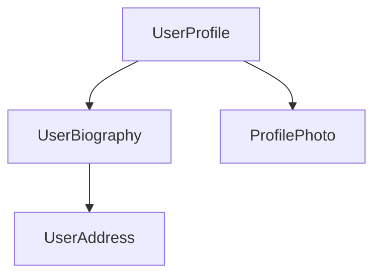

<!-- ia-translate: true -->
<docs-decorative-header title="Components" imgSrc="adev/src/assets/images/components.svg"> <!-- markdownlint-disable-line -->
O bloco de construção fundamental para criar aplicações em Angular.
</docs-decorative-header>

Components são os principais blocos de construção de aplicações Angular. Cada component representa uma parte de uma página web maior. Organizar uma aplicação em components ajuda a fornecer estrutura ao seu projeto, separando claramente o código em partes específicas que são fáceis de manter e expandir ao longo do tempo.

## Definindo um component

Todo component tem algumas partes principais:

1. Um [decorator](https://www.typescriptlang.org/docs/handbook/decorators.html) `@Component` que contém algumas configurações usadas pelo Angular.
2. Um template HTML que controla o que é renderizado no DOM.
3. Um [seletor CSS](https://developer.mozilla.org/docs/Learn/CSS/Building_blocks/Selectors) que define como o component é usado no HTML.
4. Uma classe TypeScript com comportamentos, como lidar com entrada do usuário ou fazer requisições para um servidor.

Aqui está um exemplo simplificado de um component `UserProfile`.

```angular-ts
// user-profile.ts
@Component({
  selector: 'user-profile',
  template: `
    <h1>User profile</h1>
    <p>This is the user profile page</p>
  `,
})
export class UserProfile { /* Your component code goes here */ }
```

O decorator `@Component` também aceita opcionalmente uma propriedade `styles` para qualquer CSS que você queira aplicar ao seu template:

```angular-ts
// user-profile.ts
@Component({
  selector: 'user-profile',
  template: `
    <h1>User profile</h1>
    <p>This is the user profile page</p>
  `,
  styles: `h1 { font-size: 3em; } `,
})
export class UserProfile { /* Your component code goes here */ }
```

### Separando HTML e CSS em arquivos separados

Você pode definir o HTML e CSS de um component em arquivos separados usando `templateUrl` e `styleUrl`:

```angular-ts
// user-profile.ts
@Component({
  selector: 'user-profile',
  templateUrl: 'user-profile.html',
  styleUrl: 'user-profile.css',
})
export class UserProfile {
  // Component behavior is defined in here
}
```

```angular-html
<!-- user-profile.html -->
<h1>User profile</h1>
<p>This is the user profile page</p>
```

```css
/* user-profile.css */
h1 {
  font-size: 3em;
}
```

## Usando components

Você constrói uma aplicação compondo múltiplos components juntos. Por exemplo, se você está construindo uma página de perfil de usuário, você pode dividir a página em vários components assim:



Aqui, o component `UserProfile` usa vários outros components para produzir a página final.

Para importar e usar um component, você precisa:

1. No arquivo TypeScript do seu component, adicione uma declaração `import` para o component que você quer usar.
2. No seu decorator `@Component`, adicione uma entrada no array `imports` para o component que você quer usar.
3. No template do seu component, adicione um elemento que corresponda ao seletor do component que você quer usar.

Aqui está um exemplo de um component `UserProfile` importando um component `ProfilePhoto`:

```angular-ts
// user-profile.ts
import {ProfilePhoto} from 'profile-photo.ts';

@Component({
  selector: 'user-profile',
  imports: [ProfilePhoto],
  template: `
    <h1>User profile</h1>
    <profile-photo />
    <p>This is the user profile page</p>
  `,
})
export class UserProfile {
  // Component behavior is defined in here
}
```

DICA: Quer saber mais sobre components do Angular? Veja o [guia detalhado de Components](guide/components) para todos os detalhes.

## Próximo Passo

Agora que você sabe como components funcionam no Angular, é hora de aprender como adicionamos e gerenciamos dados dinâmicos na nossa aplicação.

<docs-pill-row>
  <docs-pill title="Reatividade com signals" href="essentials/signals" />
  <docs-pill title="Guia detalhado de components" href="guide/components" />
</docs-pill-row>
