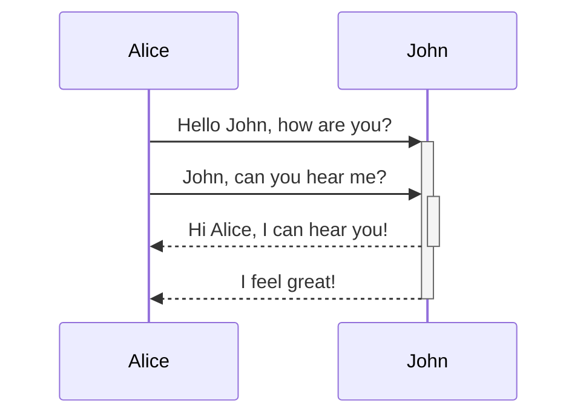
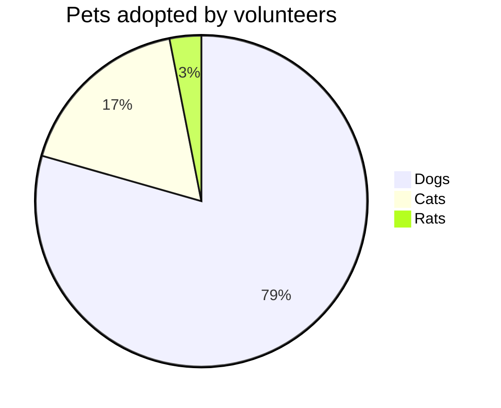

<!-- ia-translate: true -->
<docs-decorative-header title="Kitchen sink" imgSrc="adev/src/assets/images/components.svg"> <!-- markdownlint-disable-line -->
Esta é uma lista visual de todos os components customizados e estilos para Angular.dev.
</docs-decorative-header>

Como um sistema de design, esta página contém orientação visual e de autoria Markdown para:

- Elementos customizados de documentação Angular: [`docs-card`](#cards), [`docs-callout`](#callouts), [`docs-pill`](#pills), e [`docs-steps`](#workflow)
- Elementos de texto customizados: [alertas](#alerts)
- Exemplos de código: [`docs-code`](#code)
- Elementos Markdown estilizados incorporados: links, listas, [cabeçalhos](#headers-h2), [linhas horizontais](#horizontal-line-divider)
- e mais!

Prepare-se para:

1. Escrever...
2. ótima...
3. documentação!

## Headers (h2)

### Smaller headers (h3)

#### Even smaller (h4)

##### Even more smaller (h5)

###### The smallest! (h6)

## Cards

<docs-card-container>
  <docs-card title="What is Angular?" link="Platform Overview" href="tutorials/first-app">
    Lorem ipsum dolor sit amet, consectetur adipiscing elit. Nullam ornare ligula nisi
  </docs-card>
  <docs-card title="Second Card" link="Try It Now" href="essentials/what-is-angular">
    Lorem ipsum dolor sit amet, consectetur adipiscing elit. Nullam ornare ligula nisi
  </docs-card>
    <docs-card title="No Link Card">
    Lorem ipsum dolor sit amet, consectetur adipiscing elit. Nullam ornare ligula nisi
  </docs-card>
</docs-card-container>

### Atributos de `<docs-card>`

| Atributos               | Detalhes                                                          |
| :---------------------- | :---------------------------------------------------------------- |
| `<docs-card-container>` | Todos os cards devem estar aninhados dentro de um container       |
| `title`                 | Título do card                                                    |
| conteúdo do corpo       | Qualquer coisa entre `<docs-card>` e `</docs-card>`               |
| `link`                  | (Opcional) Texto do link Call to Action                           |
| `href`                  | (Opcional) Href do link Call to Action                            |

## Callouts

<docs-callout title="Title of a callout that is helpful">
  Lorem ipsum dolor sit amet, consectetur adipiscing elit. Nulla luctus metus blandit semper faucibus. Sed blandit diam quis tellus maximus, ac scelerisque ex egestas. Ut euismod lobortis mauris pretium iaculis. Quisque ullamcorper, elit ut lacinia blandit, magna sem finibus urna, vel suscipit tortor dolor id risus.
</docs-callout>

<docs-callout critical title="Title of a callout that is critical">
  Lorem ipsum dolor sit amet, consectetur adipiscing elit. Nulla luctus metus blandit semper faucibus. Sed blandit diam quis tellus maximus, ac scelerisque ex egestas. Ut euismod lobortis mauris pretium iaculis. Quisque ullamcorper, elit ut lacinia blandit, magna sem finibus urna, vel suscipit tortor dolor id risus.
</docs-callout>

<docs-callout important title="Title of a callout that is important">
  Lorem ipsum dolor sit amet, consectetur adipiscing elit. Nulla luctus metus blandit semper faucibus. Sed blandit diam quis tellus maximus, ac scelerisque ex egestas. Ut euismod lobortis mauris pretium iaculis. Quisque ullamcorper, elit ut lacinia blandit, magna sem finibus urna, vel suscipit tortor dolor id risus.
</docs-callout>

### Atributos de `<docs-callout>`

| Atributos                                        | Detalhes                                                   |
| :----------------------------------------------- | :--------------------------------------------------------- |
| `title`                                          | Título do callout                                          |
| conteúdo do corpo                                | Qualquer coisa entre `<docs-callout>` e `</docs-callout>` |
| `helpful` (padrão) \| `critical` \| `important` | (Opcional) Adiciona estilos e ícones baseados no nível de severidade |

## Pills

Linhas de pills são úteis como uma espécie de navegação com links para recursos úteis.

<docs-pill-row id=pill-row>
  <docs-pill href="#pill-row" title="Link"/>
  <docs-pill href="#pill-row" title="Link"/>
  <docs-pill href="#pill-row" title="Link"/>
  <docs-pill href="#pill-row" title="Link"/>
  <docs-pill href="#pill-row" title="Link"/>
  <docs-pill href="#pill-row" title="Link"/>
</docs-pill-row>

### Atributos de `<docs-pill>`

| Atributos        | Detalhes                                            |
| :--------------- | :-------------------------------------------------- |
| `<docs-pill-row` | Todas as pills devem estar aninhadas dentro de uma pill row |
| `title`          | Texto da pill                                       |
| `href`           | Href da pill                                        |

Pills também podem ser usadas inline sozinhas, mas ainda não construímos isso.

## Alerts

Alertas são apenas parágrafos especiais. Eles são úteis para chamar atenção (não confundir com call-out) para algo que é um pouco mais urgente. Eles ganham tamanho de fonte do contexto e estão disponíveis em vários níveis. Tente não usar alertas para renderizar muito conteúdo, mas sim para aprimorar e chamar atenção para o conteúdo ao redor.

Estilize alertas começando em uma nova linha no Markdown usando o formato `SEVERITY_LEVEL` + `:` + `ALERT_TEXT`.

NOTE: Use Note para informações auxiliares/adicionais que não são _essenciais_ ao texto principal.

TIP: Use Tip para destacar uma tarefa/ação específica que os usuários podem realizar, ou um fato que se relaciona diretamente com uma tarefa/ação.

TODO: Use TODO para documentação incompleta que você planeja expandir em breve. Você também pode atribuir o TODO, por exemplo, TODO(emmatwersky): Text.

QUESTION: Use Question para fazer uma pergunta ao leitor, como um mini-quiz que ele deveria ser capaz de responder.

SUMMARY: Use Summary para fornecer uma sinopse de duas ou três frases do conteúdo da página ou seção, para que os leitores possam descobrir se este é o lugar certo para eles.

TLDR: Use TL;DR (ou TLDR) se você pode fornecer a informação essencial sobre uma página ou seção em uma ou duas frases. Por exemplo, TLDR: Rhubarb é um gato.

CRITICAL: Use Critical para destacar coisas potencialmente ruins ou alertar o leitor de que ele deve ter cuidado antes de fazer algo. Por exemplo, Warning: Executar `rm` com a opção `-f` irá deletar arquivos ou diretórios protegidos contra escrita sem perguntar.

IMPORTANT: Use Important para informações que são cruciais para compreender o texto ou completar alguma tarefa.

HELPFUL: Use Best practice para destacar práticas que são conhecidas por serem bem-sucedidas ou melhores do que alternativas.

NOTE: Atenção `desenvolvedores`! Alertas _podem_ ter um [link](#alerts) e outros estilos aninhados (mas tente **usar isso com moderação**)!.

## Code

Você pode exibir `código` usando a tripla crase incorporada:

```ts
example code
```

Ou usando o elemento `<docs-code>`.

<docs-code header="Your first example" language="ts" linenums>
import { Component } from '@angular/core';

@Component({
selector: 'example-code',
template: '<h1>Hello World!</h1>',
})
export class ComponentOverviewComponent {}
</docs-code>

### Estilizando o exemplo

Aqui está um exemplo de código totalmente estilizado:

<docs-code
  path="adev/src/content/examples/hello-world/src/app/app.component-old.ts"
  header="A styled code example"
  language='ts'
  linenums
  highlight="[[3,7], 9]"
  preview
  visibleLines="[3,10]">
</docs-code>

Também temos estilização para o terminal, apenas defina a linguagem como `shell`:

<docs-code language="shell">
  npm install @angular/material --save
</docs-code>

#### Atributos de `<docs-code>`

| Atributos       | Tipo                 | Detalhes                                                |
| :-------------- | :------------------- | :------------------------------------------------------ |
| code            | `string`             | Qualquer coisa entre as tags é tratada como código      |
| `path`          | `string`             | Caminho para o exemplo de código (raiz: `content/examples/`) |
| `header`        | `string`             | Título do exemplo (padrão: `file-name`)                 |
| `language`      | `string`             | linguagem do código                                      |
| `linenums`      | `boolean`            | (False) exibe números de linha                           |
| `highlight`     | `string of number[]` | linhas destacadas                                        |
| `diff`          | `string`             | caminho para código alterado                             |
| `visibleLines`  | `string of number[]` | intervalo de linhas para modo de colapso                 |
| `visibleRegion` | `string`             | **DEPRECIADO** PARA `visibleLines`                       |
| `preview`       | `boolean`            | (False) exibir preview                                   |
| `hideCode`      | `boolean`            | (False) Se deve colapsar o exemplo de código por padrão. |

### Exemplos de múltiplos arquivos

Você pode criar exemplos de múltiplos arquivos envolvendo os exemplos dentro de um `<docs-code-multifile>`.

<docs-code-multifile
  path="adev/src/content/examples/hello-world/src/app/app.component.ts"
  preview>
<docs-code
    path="adev/src/content/examples/hello-world/src/app/app.component.ts"
    diff="adev/src/content/examples/hello-world/src/app/app.component-old.ts"
    linenums
    visibleLines="[3, 11]"/>
<docs-code
    path="adev/src/content/examples/hello-world/src/app/app.component.html"
    highlight="[1]"
    linenums/>
<docs-code
    path="adev/src/content/examples/hello-world/src/app/app.component.css" />
</docs-code-multifile>

#### Atributos de `<docs-code-multifile>`

| Atributos           | Tipo      | Detalhes                                                |
| :------------------ | :-------- | :------------------------------------------------------ |
| conteúdo do corpo   | `string`  | abas aninhadas de exemplos `docs-code`                  |
| `path`              | `string`  | Caminho para exemplo de código para preview e link externo |
| `preview`           | `boolean` | (False) exibir preview                                   |
| `hideCode`          | `boolean` | (False) Se deve colapsar o exemplo de código por padrão. |

### Adicionando `preview` ao seu exemplo de código

Adicionar a flag `preview` constrói um exemplo em execução do código abaixo do snippet de código. Isso também adiciona automaticamente um botão para abrir o exemplo em execução no Stackblitz.

NOTE: `preview` só funciona com standalone.

### Estilizando previews de exemplos com Tailwind CSS

Classes utilitárias do Tailwind podem ser usadas dentro de exemplos de código.

<docs-code-multifile
  path="adev/src/content/examples/hello-world/src/app/tailwind-app.component.ts"
  preview>
<docs-code path="adev/src/content/examples/hello-world/src/app/tailwind-app.component.html" />
<docs-code path="adev/src/content/examples/hello-world/src/app/tailwind-app.component.ts" />
</docs-code-multifile>

## Tabs

<docs-tab-group>
  <docs-tab label="Code Example">
    <docs-code-multifile
      path="adev/src/content/examples/hello-world/src/app/tailwind-app.component.ts"
      hideCode="true"
      preview>
    <docs-code path="adev/src/content/examples/hello-world/src/app/tailwind-app.component.html" />
    <docs-code path="adev/src/content/examples/hello-world/src/app/tailwind-app.component.ts" />
    </docs-code-multifile>
  </docs-tab>
  <docs-tab label="Some Text">
    Lorem ipsum dolor sit amet, consectetur adipiscing elit. Nulla luctus metus blandit semper faucibus. Sed blandit diam quis tellus maximus, ac scelerisque ex egestas. Ut euismod lobortis mauris pretium iaculis. Quisque ullamcorper, elit ut lacinia blandit, magna sem finibus urna, vel suscipit tortor dolor id risus.
  </docs-tab>
</docs-tab-group>

## Workflow

Estilize passos numerados usando `<docs-step>`. A numeração é criada usando CSS (prático!).

### Atributos de `<docs-workflow>` e `<docs-step>`

| Atributos          | Detalhes                                          |
| :----------------- | :------------------------------------------------ |
| `<docs-workflow>`  | Todos os passos devem estar aninhados dentro de um workflow |
| `title`            | Título do passo                                   |
| conteúdo do corpo  | Qualquer coisa entre `<docs-step>` e `</docs-step>` |

Passos devem começar em uma nova linha e podem conter `docs-code`s e outros elementos e estilos aninhados.

<docs-workflow>

<docs-step title="Install the Angular CLI">
  Você usa o Angular CLI para criar projetos, gerar código de aplicação e biblioteca, e realizar uma variedade de tarefas contínuas de desenvolvimento, como testes, bundling e deployment.

Para instalar o Angular CLI, abra uma janela de terminal e execute o seguinte comando:

  <docs-code language="shell">
    npm install -g @angular/cli
  </docs-code>
</docs-step>

<docs-step title="Create a workspace and initial application">
  Você desenvolve aplicações no contexto de um workspace Angular.

Para criar um novo workspace e aplicação inicial:

- Execute o comando CLI `ng new` e forneça o nome `my-app`, como mostrado aqui:
  <docs-code language="shell">
  ng new my-app
  </docs-code>

- O comando ng new solicita informações sobre recursos a incluir na aplicação inicial. Aceite os padrões pressionando a tecla Enter ou Return.

  O Angular CLI instala os pacotes npm Angular necessários e outras dependências. Isso pode levar alguns minutos.

  O CLI cria um novo workspace e uma aplicação de Boas-vindas simples, pronta para executar.
  </docs-step>

<docs-step title="Run the application">
  O Angular CLI inclui um servidor para você construir e servir sua aplicação localmente.

1. Navegue até a pasta do workspace, como `my-app`.
2. Execute o seguinte comando:
   <docs-code language="shell">
   cd my-app
   ng serve --open
   </docs-code>

O comando `ng serve` inicia o servidor, observa seus arquivos e reconstrói a aplicação conforme você faz alterações nesses arquivos.

A opção `--open` (ou apenas `-o`) abre automaticamente seu navegador em <http://localhost:4200/>.
Se sua instalação e configuração foram bem-sucedidas, você deve ver uma página similar à seguinte.
</docs-step>

<docs-step title="Final step">
  Esses são todos os components de documentação! Agora:

  <docs-pill-row>
    <docs-pill href="#pill-row" title="Go"/>
    <docs-pill href="#pill-row" title="write"/>
    <docs-pill href="#pill-row" title="great"/>
    <docs-pill href="#pill-row" title="docs!"/>
  </docs-pill-row>
</docs-step>

</docs-workflow>

## Imagens e vídeo

Você pode adicionar imagens usando a imagem Markdown semântica:


### Adicione `#small` e `#medium` para mudar o tamanho da imagem


Vídeos incorporados são criados com `docs-video` e só precisam de um `src` e `alt`:

<docs-video src="https://www.youtube.com/embed/O47uUnJjbJc" alt=""/>

## Gráficos e Diagramas

Escreva diagramas e gráficos usando [Mermaid](http://mermaid.js.org/) definindo a linguagem do código como `mermaid`, toda a tematização é incorporada.






## Divisor de Linha Horizontal

Isso pode ser usado para separar seções de página, como estamos prestes a fazer abaixo. Esses estilos serão adicionados por padrão, nada customizado necessário.

<hr/>

O fim!
